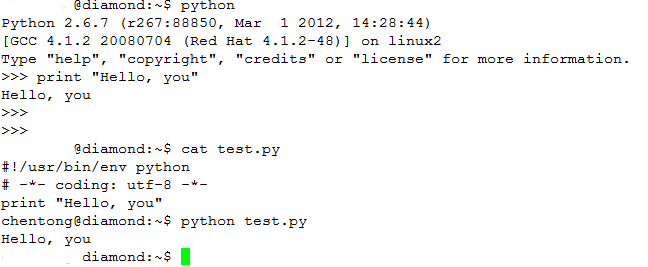

# Python 教程 {#py3_ct}

陈同 (chentong_biology@163.com)

欢迎来到Python的世界，本教程将带你遨游`Python`，领悟`Python`的魅力。本教程专注于帮助初学者，尤其是生物信息分析人员快速学会`Python`的常用功能和使用方式，因此只精选了部分`Python`的功能，请额外参考Python经典教程[A byte of python](http://www.byteofpython.info/)和它的[中文版](http://woodpecker.org.cn/abyteofpython_cn/chinese/index.html) 来更好的理解*Python*. 本文档的概念和文字描述参考了A byte of python(中文版)，特此感谢。

本教程在`2017年12月25日`更新到`Python3`版本。

This work is licensed under a <a rel="license" href="http://creativecommons.org/licenses/by-nc-sa/2.0/">Creative Commons Attribution-NonCommercial-ShareAlike 2.0 Generic License</a>.

欢迎访问我们的视频课程 <https://bioinfo.ke.qq.com>。

## 背景介绍

### 编程开篇

A：最近在看什么书？

B：编程。

A：沈从文的那本啊。

B：……

</img>

---


C：最近在学一门新语言，Python。

D：那是哪个国家的语言？

C：……

### 为什么学习Python

* 语法简单 
    
    Python语言写作的程序就像自然语言构建的伪代码一样，“所见即所想”。读`Python`代码就像读最简单的英文短文一样，写`Python`代码比写英文文章都要简单，“所想即所写”。很多刚学习`Python`的朋友都觉得很不可思议，原来怎么想怎么写出来就对了。

* 功能强大
    
    现在程序语言的发展已经很成熟，每一种程序语言都能实现其它程序语言的全部功能。因此就程序语言本身来讲，功能都相差不大。`Python`语言的功能强大在于其活跃的社区和强大的第三方模块支持，使其作为科学计算的能力越来越强。

* 可扩展性好
    
    能与C完美的融合，加快运行速度。可用加速模块有`Cython`, `PyPy`, `Pyrex`, `Psyco`等.

### Python常用包

1. 科学计算 `Numpy`, `SciPy` (也是安装python包的拦路虎直到有了[conda](http://mp.weixin.qq.com/s/A4_j8ZbyprMr1TT_wgisQQ))
2. 类比于R的数据框操作包 [Pandas](http://mp.weixin.qq.com/s/1h-_J2NKjD1KyymPAeHPOg)
3. 可视化工具 `Seaborn` (配合pandas), `matplotlib` (类比MATLAB), `plotly` (交互式绘图), `ggplot` (类比ggplot2)
4. 网站开发 `web.py`, `Django`, `Flask`
5. 任务调度和流程管理 `Airflow` (pipeline首选)
6. 机器学习 `scikit-learn` (经典), `PyML`, `Tensorflow` (谷歌释放), `pylearn2`, `Orange` (图形界面的机器学习包)
7. 网页抓取 `Beautiful Soup`，`requests`, 
8. 可重复编程 `Jupyter`
9. 正则表达式 `re`

### 怎么学习Python

编程就像拼乐高，需要我们知道每个组分的特征以便在需要时可以使用，也需要脑袋中有个蓝图知道每一步要做什么，二者结合，就可以拼出你想要的世界。

在我看来，学习编程是**学以致用**，学习方式是**硬着头皮**去读，去写。

* 多读经典书籍 
    
    首先从概念和理论上了解程序设计或Python程序设计，多读。书读百遍其义自见。

* 多做练习
    
    任何练习题都可以，先易后难。如果能找到专业相关的，更好。

* 多读代码
    
    多读优秀的代码，矫正自己的习惯和思维。

### Python学习的几个阶段

```{r}
knitr::include_graphics("coding_is_hard_confidence_competence.png")
```

（图例“编程信心与能力”：纵轴为信心值，横轴为能力水平，虚线从左至右依次分割出手牵手蜜月期、混沌悬崖、绝望沙漠、令人兴奋的上升期四个阶段，第5条虚线标志着工作准备就绪）

* 读文档是蜜月期，读读就过去，谁都会。

* 写程序是混沌悬崖，知道是这么回事，就是写不出来；

* 调程序是绝望沙漠，怎么看自己写的都对，就是编译器不开眼；

* 程序正确了就是兴奋期，万里长征迈出又一步。

### 如何安装Python

Python社区有很多功能很好的包，但逐个安装需要解决繁杂的依赖关系。通常我会推荐安装已经做好的集成包，一劳永逸的解决后续问题。[Anaconda](https://store.continuum.io/cshop/anaconda/)是最优先推荐的分发包，集成了常用的数值计算、图形处理、可视化等工具包如`IPython`, `matplotlib`, `numpy`, `scipy`, 而且设定了更简单的安装Python模块的方法，可以节省大量的安装时间。 


#### Python 常用包

1. 科学计算 `Numpy`, `SciPy` (也是安装python包的拦路虎直到有了[conda](http://mp.weixin.qq.com/s/A4_j8ZbyprMr1TT_wgisQQ))
2. 类比于R的数据框操作包 [Pandas](http://mp.weixin.qq.com/s/1h-_J2NKjD1KyymPAeHPOg)
3. 可视化工具 `Seaborn` (配合pandas), `matplotlib` (类比MATLAB), `plotly` (交互式绘图), `ggplot` (类比ggplot2)
4. 网站开发 `web.py`, `Django`, `Flask`
5. 任务调度和流程管理 `Airflow` (pipeline首选)
6. 机器学习 `scikit-learn` (经典), `PyML`, `Tensorflow` (谷歌释放), `pylearn2`, `Orange` (图形界面的机器学习包)
7. 网页抓取 `Beautiful Soup`，`requests`, 
8. 可重复编程 `Jupyter`
9. 正则表达式 `re`

### 如何运行Python命令和脚本

* 对于初学者，本手册推荐直接在`Jupyter Notebook`下学习`Python`命令和脚本。我们这套教程也是用`Jupyter Notebook`写作而成，里面的代码可以随时修改和运行，并能同时记录你的脚本和输出，符合现在流行的“可重复性计算”的概念。
    * Linux/Unix用户直接在终端(Terminal)进入你的目标文件夹`cd /working_dir`[回车]，然后在终端输入`Jupyter notebook`[回车]即可启动`Jupyter notebook`。
    * Windows用户可以新建一个`Jupyter_notebook.bat`文件(新建一个txt文件，写入内容后修改后缀为`.bat`。若不能修改后缀，请Google搜索“Window是如何显示文件扩展名”)，并写入以下内容（注意把前两行的*盘符*和*路径*替换为你的工作目录），双击即可运行。
```
        D:
        cd PBR_training
        jupyter notebook
        pause
```
    * `Jupyter notebook`启动后会打开默认的浏览器（需要在图形用户界面下工作），这时可以`新建`或`打开`相应路径下的ipynb文件。
    
* 对于LInux或Unix用户，直接在终端输入 `python` 然后回车即可打开交互式`python`解释器，如下图所示。在这个解释器了敲入任何合法的`python`语句即可执行。此外，所有的命令还可以存储到一个文件一起执行，如下图所示。我们有一个包含`python`程序的文件`test.py`，我们只要在终端输入`python test.py`并回车就可以运行这个文件。同时我们也可在终端通过输入`chmod 755 test.py`赋予程序`test.py`可执行权限，并在终端输入`./test.py`运行`Python`脚本。更多Linux下的高级使用和Linux命令使用请见教程Bash_training-chinese.ipynb。 

```{r}

```

* 对于Windows用户，可以通过“Windows键+R”调出“Run”窗口并输入“cmd”打开Windows命令解释器，输入`python`即可打开交互式`python`解释器。同时也可以双击安装后的软件的快捷方式打开图形界面的`Python`解释器，可以处理交互式命令和导入Python文件并执行。

* 对于交互式`Python`解释器，在使用结束后，通过键盘组合键`Ctrl-d` (Linux/Unix)或`Ctrl-z` (Windows)关闭。

### 使用什么编辑器写Python脚本

在你学成之后，可能主要操作都在服务器完成，而且日常工作一般会以脚本的形式解决。我个人推荐使用[Vim](http://www.vim.org/download.php)来写作Python脚本。

Linux下`vim`的配置文件可从[我的 github](https://github.com/Tong-Chen/vim)下载，Windows版可从[我的百度云](http://pan.baidu.com/s/1kT5KIN1) 下载。 

## Python程序事例


```python
## 假如我们有如下FASTA格式的文件，我们想把多行序列合并为一行，怎么做？
for line in open("data/test2.fa"):
    print(line.strip())
```

    >NM_001011874 gene=Xkr4 CDS=151-2091
    gcggcggcgggcgagcgggcgctggagtaggagctggggagcggcgcggccggggaaggaagccagggcg
    aggcgaggaggtggcgggaggaggagacagcagggacaggTGTCAGATAAAGGAGTGCTCTCCTCCGCTG
    CCGAGGCATCATGGCCGCTAAGTCAGACGGGAGGCTGAAGATGAAGAAGAGCAGCGACGTGGCGTTCACC
    CCGCTGCAGAACTCGGACAATTCGGGCTCTGTGCAAGGACTGGCTCCAGGCTTGCCGTCGGGGTCCGGAG
    >NM_001195662 gene=Rp1 CDS=55-909
    AAGCTCAGCCTTTGCTCAGATTCTCCTCTTGATGAAACAAAGGGATTTCTGCACATGCTTGAGAAATTGC
    AGGTCTCACCCAAAATGAGTGACACACCTTCTACTAGTTTCTCCATGATTCATCTGACTTCTGAAGGTCA
    AGTTCCTTCCCCTCGCCATTCAAATATCACTCATCCTGTAGTGGCTAAACGCATCAGTTTCTATAAGAGT
    GGAGACCCACAGTTTGGCGGCGTTCGGGTGGTGGTCAACCCTCGTTCCTTTAAGACTTTTGACGCTCTGC
    TGGACAGTTTATCCAGGAAGGTACCCCTGCCCTTTGGGGTAAGGAACATCAGCACGCCCCGTGGACGACA
    CAGCATCACCAGGCTGGAGGAGCTAGAGGACGGCAAGTCTTATGTGTGCTCCCACAATAAGAAGGTGCTG
    >NM_011283 gene=Rp1 CDS=128-6412
    AATAAATCCAAAGACATTTGTTTACGTGAAACAAGCAGGTTGCATATCCAGTGACGTTTATACAGACCAC
    ACAAACTATTTACTCTTTTCTTCGTAAGGAAAGGTTCAACTTCTGGTCTCACCCAAAATGAGTGACACAC
    CTTCTACTAGTTTCTCCATGATTCATCTGACTTCTGAAGGTCAAGTTCCTTCCCCTCGCCATTCAAATAT
    CACTCATCCTGTAGTGGCTAAACGCATCAGTTTCTATAAGAGTGGAGACCCACAGTTTGGCGGCGTTCGG
    GTGGTGGTCAACCCTCGTTCCTTTAAGACTTTTGACGCTCTGCTGGACAGTTTATCCAGGAAGGTACCCC
    TGCCCTTTGGGGTAAGGAACATCAGCACGCCCCGTGGACGACACAGCATCACCAGGCTGGAGGAGCTAGA
    GGACGGCAAGTCTTATGTGTGCTCCCACAATAAGAAGGTGCTGCCAGTTGACCTGGACAAGGCCCGCAGG
    CGCCCTCGGCCCTGGCTGAGTAGTCGCTCCATAAGCACGCATGTGCAGCTCTGTCCTGCAACTGCCAATA
    TGTCCACCATGGCACCTGGCATGCTCCGTGCCCCAAGGAGGCTCGTGGTCTTCCGGAATGGTGACCCGAA
    >NM_0112835 gene=Rp1 CDS=128-6412
    AATAAATCCAAAGACATTTGTTTACGTGAAACAAGCAGGTTGCATATCCAGTGACGTTTATACAGACCAC
    ACAAACTATTTACTCTTTTCTTCGTAAGGAAAGGTTCAACTTCTGGTCTCACCCAAAATGAGTGACACAC
    CTTCTACTAGTTTCTCCATGATTCATCTGACTTCTGAAGGTCAAGTTCCTTCCCCTCGCCATTCAAATAT
    CACTCATCCTGTAGTGGCTAAACGCATCAGTTTCTATAAGAGTGGAGACCCACAGTTTGGCGGCGTTCGG
    GTGGTGGTCAACCCTCGTTCCTTTAAGACTTTTGACGCTCTGCTGGACAGTTTATCCAGGAAGGTACCCC
    TGCCCTTTGGGGTAAGGAACATCAGCACGCCCCGTGGACGACACAGCATCACCAGGCTGGAGGAGCTAGA
    GGACGGCAAGTCTTATGTGTGCTCCCACAATAAGAAGGTGCTGCCAGTTGACCTGGACAAGGCCCGCAGG
    CGCCCTCGGCCCTGGCTGAGTAGTCGCTCCATAAGCACGCATGTGCAGCTCTGTCCTGCAACTGCCAATA
    TGTCCACCATGGCACCTGGCATGCTCCGTGCCCCAAGGAGGCTCGTGGTCTTCCGGAATGGTGACCCGAA


```python
aDict = {}
for line in open('data/test2.fa'):
    if line[0] == '>':
        key = line.strip()
        aDict[key] = []
    else:
        aDict[key].append(line.strip())
##------------------------------------------
for key, valueL in list(aDict.items()):
    print(key)
    print(''.join(valueL))
```

    >NM_001011874 gene=Xkr4 CDS=151-2091
    gcggcggcgggcgagcgggcgctggagtaggagctggggagcggcgcggccggggaaggaagccagggcgaggcgaggaggtggcgggaggaggagacagcagggacaggTGTCAGATAAAGGAGTGCTCTCCTCCGCTGCCGAGGCATCATGGCCGCTAAGTCAGACGGGAGGCTGAAGATGAAGAAGAGCAGCGACGTGGCGTTCACCCCGCTGCAGAACTCGGACAATTCGGGCTCTGTGCAAGGACTGGCTCCAGGCTTGCCGTCGGGGTCCGGAG
    >NM_001195662 gene=Rp1 CDS=55-909
    AAGCTCAGCCTTTGCTCAGATTCTCCTCTTGATGAAACAAAGGGATTTCTGCACATGCTTGAGAAATTGCAGGTCTCACCCAAAATGAGTGACACACCTTCTACTAGTTTCTCCATGATTCATCTGACTTCTGAAGGTCAAGTTCCTTCCCCTCGCCATTCAAATATCACTCATCCTGTAGTGGCTAAACGCATCAGTTTCTATAAGAGTGGAGACCCACAGTTTGGCGGCGTTCGGGTGGTGGTCAACCCTCGTTCCTTTAAGACTTTTGACGCTCTGCTGGACAGTTTATCCAGGAAGGTACCCCTGCCCTTTGGGGTAAGGAACATCAGCACGCCCCGTGGACGACACAGCATCACCAGGCTGGAGGAGCTAGAGGACGGCAAGTCTTATGTGTGCTCCCACAATAAGAAGGTGCTG
    >NM_011283 gene=Rp1 CDS=128-6412
    AATAAATCCAAAGACATTTGTTTACGTGAAACAAGCAGGTTGCATATCCAGTGACGTTTATACAGACCACACAAACTATTTACTCTTTTCTTCGTAAGGAAAGGTTCAACTTCTGGTCTCACCCAAAATGAGTGACACACCTTCTACTAGTTTCTCCATGATTCATCTGACTTCTGAAGGTCAAGTTCCTTCCCCTCGCCATTCAAATATCACTCATCCTGTAGTGGCTAAACGCATCAGTTTCTATAAGAGTGGAGACCCACAGTTTGGCGGCGTTCGGGTGGTGGTCAACCCTCGTTCCTTTAAGACTTTTGACGCTCTGCTGGACAGTTTATCCAGGAAGGTACCCCTGCCCTTTGGGGTAAGGAACATCAGCACGCCCCGTGGACGACACAGCATCACCAGGCTGGAGGAGCTAGAGGACGGCAAGTCTTATGTGTGCTCCCACAATAAGAAGGTGCTGCCAGTTGACCTGGACAAGGCCCGCAGGCGCCCTCGGCCCTGGCTGAGTAGTCGCTCCATAAGCACGCATGTGCAGCTCTGTCCTGCAACTGCCAATATGTCCACCATGGCACCTGGCATGCTCCGTGCCCCAAGGAGGCTCGTGGTCTTCCGGAATGGTGACCCGAA
    >NM_0112835 gene=Rp1 CDS=128-6412
    AATAAATCCAAAGACATTTGTTTACGTGAAACAAGCAGGTTGCATATCCAGTGACGTTTATACAGACCACACAAACTATTTACTCTTTTCTTCGTAAGGAAAGGTTCAACTTCTGGTCTCACCCAAAATGAGTGACACACCTTCTACTAGTTTCTCCATGATTCATCTGACTTCTGAAGGTCAAGTTCCTTCCCCTCGCCATTCAAATATCACTCATCCTGTAGTGGCTAAACGCATCAGTTTCTATAAGAGTGGAGACCCACAGTTTGGCGGCGTTCGGGTGGTGGTCAACCCTCGTTCCTTTAAGACTTTTGACGCTCTGCTGGACAGTTTATCCAGGAAGGTACCCCTGCCCTTTGGGGTAAGGAACATCAGCACGCCCCGTGGACGACACAGCATCACCAGGCTGGAGGAGCTAGAGGACGGCAAGTCTTATGTGTGCTCCCACAATAAGAAGGTGCTGCCAGTTGACCTGGACAAGGCCCGCAGGCGCCCTCGGCCCTGGCTGAGTAGTCGCTCCATAAGCACGCATGTGCAGCTCTGTCCTGCAACTGCCAATATGTCCACCATGGCACCTGGCATGCTCCGTGCCCCAAGGAGGCTCGTGGTCTTCCGGAATGGTGACCCGAA


## Python语法

### 层级缩进

* 合适的缩进。空白在Python中是很重要的，它称为缩进。在逻辑行首的空白（空格和制表符）用来决定逻辑行的缩进层次，从而用来决定语句的分组。这意味着同一层次的语句必须有相同的缩进。每一组这样的语句称为一个块。通常的缩进为4个空格, 在`Jupyter Notebook`中为一个`Tab`键。
  
  从下面这两个例子可以看出错误的缩进类型和对应的提示。
  * "unexpected indent" 表示在不该出现空白的地方多了空白，并且指出问题出在第三行(line 3)。
  * "expected an indented block" 表示应该有缩进的地方未缩进，也指出了问题所在行。
  * "unindent does not match any outer indentation level" 表示缩进出现了不一致，问题通常会在指定行**及其前面的行**。


```python
print("不合适的缩进会引发错误，b前不该有的缩进")
a = 'No indent'
 b = '我前面有个空格……'
```


      File "<ipython-input-2-ff110daefedf>", line 3
        b = '我前面有个空格……'
        ^
    IndentationError: unexpected indent


```python
print("不合适的缩进，print是for的子语句，应该有缩进，却漏掉了")
a = [1,2,3]

for i in a:
print "我应该被缩进，我从属于for循环!!!\n"
```


      File "<ipython-input-3-84bbc644895e>", line 5
        print "我应该被缩进，我从属于for循环!!!\n"
            ^
    IndentationError: expected an indented block


```python
a = [1,2, 3]
if a:
    for i in a:
        print(i)
       print(i + 1, 
             "为什么我的缩进跟其它行不一样呢，我的空格被谁吃了？")
         print(i + 1, 
               "为什么我的缩进跟其它行不一样呢，谁给了我个空格？")
```


      File "<tokenize>", line 5
        print(i + 1,
        ^
    IndentationError: unindent does not match any outer indentation level


### Python作为计算器的使用

Python中可以进行基本的数学运算，与小学中学过的一样，加减乘除取余数等，需要注意的是运算符的优先级。


```python
2 + 2
```


    4


```python
2 + 3 +5
```


    10


```python
2 + 3 * 5 
```


    17


```python
(2 + 3) * 5
```


    25


```python
## 整除
23 // 7
```


    3


```python
## 取余数
23 % 7
```


    2


#### 第一个小程序


```python
print("Hello, Python!")
```

    Hello, Python!


```python
myname = input("Your name: ")
print("Hello", myname)
```

    Your name: CT
    Hello CT


### 变量、数据结构、流程控制

我们先看一个动图展示内存中变量的赋值、存储、值的改变和程序的运行。

点击访问动图 <http://www.ehbio.com/ehbio_resource/python_tutor.gif>

* 常量，指固定的数字或字符串，如`2`, `2.9`, `"Hello world"`等。 

* 变量，存储了数字或字符串的事物称为变量，它可以被赋值或被修改。简单的可以理解为变量是一个盒子，你可以把任何东西放在里面，通过盒子的名字来取出盒子内的东西。
    * 数值变量：存储了数的变量。     
    * 字符串变量：存储了字符串的变量。字符串变量的名字最好不为`str`，可以使用`aStr`。
    * 列表 (list): list是处理一组*有序*项目的数据结构，即你可以在一个列表中存储一个 *序列* 的项目。假想你有一个购物列表，上面记载着你要买的东西，你就容易理解列表了。只不过在你的购物表上，可能每样东西都独自占有一行，而在Python中，你在每个项目之间用逗号分割。列表中的项目应该包括在**方括号**中，这样Python就知道你是在指明一个列表。一旦你创建了一个列表，你可以添加、删除或是搜索列表中的项目。由于你可以增加或删除项目，我们说列表是 *可变的* 数据类型，即这种类型是可以被改变的。列表变量的名字最好不为`list`，可以使用`aList`。
    * 元祖 (tuple)：元组和列表十分类似，但是不可修改。元组通过**圆括号中用逗号分割的项目**定义。元组通常用在使语句或用户定义的函数能够安全地采用一组值的时候，即被使用的元组的值不会改变。元组变量的名字最好不为`tuple`，可以使用`aTuple`。
    * 集合 (Set)：也与列表类似，但是元素不可重复。通常用来去除重复、求交集、并集等。而且集合的查询速度远远快于列表，可以用来提高运算速度。
    * 字典 (dict): 字典类似于你通过联系人名字查找地址和联系人详细情况的地址簿，即，我们把键（名字）和值（详细情况）联系在一起。注意，键必须是唯一的，就像如果有两个人恰巧同名的话，你无法找到正确的信息。多个键可以指向同一个值。当一个键需要指向多个值时，这些值需要放在列表、元组或字典里面。注意，你只能使用不可变的对象（字符串，数字，元组）来作为字典的键，但是可以用不可变或可变的对象作为字典的值。键值对在字典中以这样的方式标记：d = {key1 : value1, key2 : value2 }。注意它们的键/值对用冒号分割，而各个对用逗号分割，所有这些都包括在**花括号**中。记住字典中的键/值对是没有顺序的。如果你想要一个特定的顺序，那么你应该在使用前自己对它们排序。列表变量的名字最好不为`dict`，可以使用`aDict`。
    * 序列：列表、元组、字符串都是一种序列格式。同时还可以使用range来产生序列。序列的两个主要操作时*索引操作*和*切片操作*。

* 标示符  
    * 变量的名字被称为标示符。标识符对大小写敏感，第一个字符必须是字母表中的字母（大写或小写）或者一个下划线（\_），其它部分额外包含数字。有效的标示符有: `abc`, `_abc`, `a_b_2`, `__23`等。无效的标示符有: `2a`, `3b`。
    * 标示符最好不使用Python内置的关键字，如`str`, `list`, `int`, `def`, `split`, `dict`等。
    * 标示符最好能言词达意，即展示变量的类型，又带有变量的实际含义。如`line`表示文件的一行，`lineL`表示存有从文件读入的每一行的列表。

* 控制流
    * `if`语句
      
      `if`语句用来检验一个条件，如果条件为真，我们运行一块语句（称为 `if-块`），否则我们处理另外一块语句（称为 `else-块`）。`else` 从句是可选的。如果有多个条件，中间使用`elif`。
      
      举个例子：“买五个包子，如果看到卖西瓜的，买一个”——最后程序猿买了一个包子”
      ```
      买包子 = 5
      if 看到卖西瓜的:
          买包子 = 1
      ```
      
    * `For`语句
      
      for..in是一个循环语句，它在一序列的对象上递归,即逐一使用队列中的每个项目。
      
    * `While`语句
      
      只要在一个条件为真的情况下，`while`语句允许你重复执行一块语句。`while`语句是所谓 *循环* 语句的一个例子。`while`语句有一个可选的`else`从句。
       
    * `break`语句是用来 *终止* 循环语句的，即哪怕循环条件没有成为False或序列还没有被完全递归，也停止执行循环语句。
    
      一个重要的注释是，如果你从`for`或`while`循环中 *终止* ，任何对应的循环else块将不执行。
      
    * `continue`语句被用来告诉`Python`跳过当前循环块中的剩余语句，然后 *继续* 进行下一轮循环。
    
    * 逻辑运算符 `and`, `or`, `not`。 
    


```python
## 变量名命名:为清晰表达，驼峰式，下划线式
LookLikeThis = 1
look_like_this = 'a'
```

#### Python中的数据类型：整数（int）、浮点（float）和字符串（str）


```python
type(2)
```


    int


```python
type(2.5)
```


    float


```python
type("Hello, everyone")
```


    str


```python
type([1,2,3])
```


    list


```python
## 类型转换函数
str()
int()
float()
```


```python
str(2)
```


    '2'


```python
## 字符和数字不同
42 != "42"
```


    True


```python
42 == int("42")
```


    True


```python
## This is my first python program！

myName = input("Hello, what is your name?")
print('It is  good to meet you,' + myName)
print('The length of your name is', str(len(myName)))

myAge = input('What is your age?')
print('You will be ' + str(int(myAge) + 1) + ' in a year.')
```

    Hello, what is your name?CT
    It is  good to meet you,CT
    The length of your name is 2
    What is your age?20
    You will be 21 in a year.


#### 逻辑值和比较操作


```python
a = False
a
```


    False


```python
b = True
b
```


    True


```python
a = "False"
a
```


    'False'


```python
42 == 40
```


    False


```python
42 == "42"
```


    False


```python
30 == 30
```


    True


```python
## 注意赋值(一个=)和比较(==)的区别
a = 'hello'

a == 'hello'
```


    True


##### 布尔操作符`and`, `or`, `not`

* 逻辑与 `and`：所有为真才为真
* 逻辑或 `or`：所有为假才为假
* 逻辑非 `not`: 真变假，假变真


```python
(3 > 2) and (5 < 6)
```


    True


```python
(3 < 2) or (5 < 6)
```


    True


```python
not True
```


    False


#### 控制流

if 条件（True or False） ：

    代码块1
    
elif 条件 ：
    
    代码块
    
else ：

    代码块2


```python
##条件
name = input('Please enter a name and click Enter\n')
if name == 'ehbio':
    print ('hello ehbio')
else :
    print ('You are not ehbio')
```

    Please enter a name and click Enter
    CT
    You are not ehbio


#### While循环


```python
a = 0
while a < 5:
    print('Hello, world')
    a = a + 1
```

    Hello, world
    Hello, world
    Hello, world
    Hello, world
    Hello, world


#### 数值变量操作


```python
print("数值变量")
a = 5   #注意等号两边的空格，为了易于辨识，操作符两侧最好有空格，数量不限
print(a)

print()
print("The type of a is", type(a))

##print "这是保留节目，通常判断变量的类型使用的不是type是isinstance."
##print "a is an int, ", isinstance(a,int)

## 再次赋值就是覆盖
a = 6
print(a)
```

    数值变量
    5
    
    The type of a is <class 'int'>
    6


```python
## 判断
print("比较数值的大小")
a = 5

## 注意大于号两边的空格，为了易于辨识，操作符两侧最好有空格，数量不限
if a > 4:
    print("a is larger than 4.")
elif a == 4:
    print("a is equal to 4.")
else:
    print("a is less than 4")
```

    比较数值的大小
    a is larger than 4.


```python
print("给定数值变量a和b的值，通过判断和重新赋值使得a的值小，b的值大")
a = 5
b = 3

if a > b:
    a,b = b,a
##-------------------
print(a)
print(b)
```

    给定数值变量a和b的值，通过判断和重新赋值使得a的值小，b的值大
    3
    5


```python
print('''#数值运算, 符合传统的优先级，需要使用括号来改变优先级，
和小学学的数学一模一样！！''')
a = 5
b = 3

print("a + b =", a + b)
print("a * b =", a * b)
print("a / b =", a / b)  # 1
print("2 * (a+b) =", 2 * (a + b))
print("取余数： a % b =", a % b)
print("取余数是很好的判断循环的地方，因为每个固定的周期余数就会循环一次")
```

    #数值运算, 符合传统的优先级，需要使用括号来改变优先级，
    和小学学的数学一模一样！！
    a + b = 8
    a * b = 15
    a / b = 1.6666666666666667
    2 * (a+b) = 16
    取余数： a % b = 2
    取余数是很好的判断循环的地方，因为每个固定的周期余数就会循环一次


```python
3 / 0
```


    ---------------------------------------------------------------------------

    ZeroDivisionError                         Traceback (most recent call last)

    <ipython-input-17-2b706ee9dd8e> in <module>()
    ----> 1 3 / 0
    

    ZeroDivisionError: division by zero


#### 字符串变量操作


```python
print("字符串变量")

## 注意引号的配对
a = "Hello, welcome to Python"

##a = 123
##a = str(a)

print("The string a is:", a)
print()

## 占位符
print("The length of this string <%s> is %d" % (a, len(a)))
print()

print("The type of a is", type(a))
```

    字符串变量
    The string a is: Hello, welcome to Python
    
    The length of this string <Hello, welcome to Python> is 24
    
    The type of a is <class 'str'>


```python
a = "大事赖独断而不赖众谋"
print("The string a is:", a)
print()

## len函数：获得字符串长度
print("The length of this string <%s> is %d" % (a, len(a)))
print()
```

    The string a is: 大事赖独断而不赖众谋
    
    The length of this string <大事赖独断而不赖众谋> is 10
    


```python
a = "Hello, welcome to Python"

print("取出字符串的第一个字符、最后一个字符、中间部分字符")
print("The first character of a is %s\n" % a[0])

print("The first five characters of a are %s\n" % a[0:5])

print("The last character of a is %s\n" % a[-1])
print("The last two characters of a are %s\n" % a[-2:])
print("The last character of a is %s\n" % a[len(a) - 1])
print("\n这部分很重要啊，字符串的索引和切片操作是及其常用的。")
```

    取出字符串的第一个字符、最后一个字符、中间部分字符
    The first character of a is H
    
    The first five characters of a are Hello
    
    The last character of a is n
    
    The last two characters of a are on
    
    The last character of a is n
    
    
    这部分很重要啊，字符串的索引和切片操作是及其常用的。


```python
a = "oaoaoaoa"

print("遍历字符串")
for i in a:
    print(i)

print()
print("The index of first <o> is: ",a.find('o'))
print("The index of first <c> is: ",a.find('c'))
    
print("输出符合特定要求的字符的位置")
print()
pos = 0
for i in a:
    pos += 1
    if i == 'o':
        print(pos)
    #-------------------
##-----------------------
print('''\n知道吗？不经意间我们写出了Python的
一个内置的标准函数find或者index,而且功能还更强大''')

print('''\n自己尝试实现程序语言内建的函数是学习程序语言
的很好方法。''')
```

    遍历字符串
    o
    a
    o
    a
    o
    a
    o
    a
    
    The index of first <o> is:  0
    The index of first <c> is:  -1
    输出符合特定要求的字符的位置
    
    1
    3
    5
    7
    
    知道吗？不经意间我们写出了Python的
    一个内置的标准函数find或者index,而且功能还更强大
    
    自己尝试实现程序语言内建的函数是学习程序语言
    的很好方法。


```python
print("我们看看用内置函数如何找到所有 o 的位置\n")
a = "oaoaoaoa"

print("内置函数find只能确定最先出现的 o 的位置")
pos = a.find('o')

print("因此，我们要在发现 o 之后，截取其后的字符串，再执行find操作")
while 1:
    print(pos + 1)
    new = a[pos + 1:].find('o')
    if new == -1:
        break
    pos = new + pos + 1
## help(str)
```

    我们看看用内置函数如何找到所有 o 的位置
    
    内置函数find只能确定最先出现的 o 的位置
    因此，我们要在发现 o 之后，截取其后的字符串，再执行find操作
    1
    3
    5
    7


```python
print()
print("利用split分割字符串\n")
str1 = "a b c d e f g"
strL = str1.split(' ')
print(strL)
print("\n使用split命令就可以把字符串分成列表了，想取用哪一列都随便你了。")
## 使用下面的命令查看可以对字符串进行的操作
## help(str)
```

    
    利用split分割字符串
    
    ['a', 'b', 'c', 'd', 'e', 'f', 'g']
    
    使用split命令就可以把字符串分成列表了，想取用哪一列都随便你了。


```python
print("字符串的连接\n")

a = "Hello"
b = "Python"
c = a + ', ' + b
print(c)
print("\n原来字符串相加就可以连起来啊！\n")
print('''注意，这不是连接字符串最好的方式。
考虑到字符串是不可修改的，每次连接操作都是新开辟一个内存空间，
把字符串存到里面，这样的连接操作执行几十万次会很影响运行速度。''')
```

    字符串的连接
    
    Hello, Python
    
    原来字符串相加就可以连起来啊！
    
    注意，这不是连接字符串最好的方式。
    考虑到字符串是不可修改的，每次连接操作都是新开辟一个内存空间，
    把字符串存到里面，这样的连接操作执行几十万次会很影响运行速度。


关于字符串链接为什么不推荐使用 `+`，文章[为啥我的Python这么慢 (一)](https://mp.weixin.qq.com/s/n5kkZfC8FGlzeBODarLHcw)给出了一个很好的演示例子。


```python
print('''去除字符串中特定的字符。通常我们在文件中读取的一行都包含换行符，
linux下为\\n \n''')  # \\转义字符

a = "oneline\n"
print("Currently, the string <a> is **", a, "**. \
\n The length of string <a> is **", len(a), "**. \
\n 我为什么换到下一行了？\n")

a = a.strip()
print("Currently, the string <a> is **", a, "**. \
\n The length of string <a> is **", len(a), "**. \
\n 删掉了换行符后，少了个字符，而且没换行！\n")

a = a.strip('o')
print("Currently, the string <a> is **", a, "**. \
\n The length of string <a> is **", len(a), "**. \
又少了个字符！！\n")

a = a.strip('one')
print("Currently, the string <a> is **", a, "**. \
\n The length of string <a> is **", len(a), "**. \
又少字符了！！\n")
```

    去除字符串中特定的字符。通常我们在文件中读取的一行都包含换行符，
    linux下为\n 
    
    Currently, the string <a> is ** oneline
     **. 
     The length of string <a> is ** 8 **. 
     我为什么换到下一行了？
    
    Currently, the string <a> is ** oneline **. 
     The length of string <a> is ** 7 **. 
     删掉了换行符后，少了个字符，而且没换行！
    
    Currently, the string <a> is ** neline **. 
     The length of string <a> is ** 6 **. 又少了个字符！！
    
    Currently, the string <a> is ** li **. 
     The length of string <a> is ** 2 **. 又少字符了！！
    


```python
print("字符串的替换\n")

a = "Hello, Python"
b = a.replace("Hello", "Welcome")
print("原始字符串是:", a)
print()
print("替换后的字符串是:", b)
print()

c = a.replace("o", "O")
print(c)
print("所有的o都被替换了！\n")

print("如果我只替换第一个o怎么办呢？\n")
c = a.replace("o", "O", 1)
print(c)
```

    字符串的替换
    
    原始字符串是: Hello, Python
    
    替换后的字符串是: Welcome, Python
    
    HellO, PythOn
    所有的o都被替换了！
    
    如果我只替换第一个o怎么办呢？
    
    HellO, Python


```python
## 中文替换也可以
a = "忙处事为，常向闲中先检点，过举自稀；动时念想，预从静里密操持，非心自息。"
print(a.replace('；', '\n'))
```

    忙处事为，常向闲中先检点，过举自稀
    动时念想，预从静里密操持，非心自息。


```python
print("字符串帮助，查看字符串可用方法")
help(str)
```


```python
print("大小写判断和转换")
a = 'Sdsdsd'
print("All elements in <%s> is lowercase: %s" % (a, a.islower()))
print("Transfer all elments in <%s> to lowerse <%s>" % (a, a.lower()))
print("Transfer all elments in <%s> to upperse <%s>" % (a, a.upper()))
```

    大小写判断和转换
    All elements in <Sdsdsd> is lowercase: False
    Transfer all elments in <Sdsdsd> to lowerse <sdsdsd>
    Transfer all elments in <Sdsdsd> to upperse <SDSDSD>


```python
print("这个是个保留节目，有兴趣的看，无兴趣的跳过不影响学习")
print('''字符串是不可修改的，
同一个变量名字赋不同的只实际是产生了多个不同的变量。
不同的变量名字赋同样的值，用于比较时相等，但引用不同的区域''')


b = "123456"
## print b
print("The memory index of b is", id(b))
for i in range(1, 15, 2):
    b = b + '123456'
    # print b
    print("The memory index of b is", id(b))
```

    这个是个保留节目，有兴趣的看，无兴趣的跳过不影响学习
    字符串是不可修改的，
    同一个变量名字赋不同的只实际是产生了多个不同的变量。
    不同的变量名字赋同样的值，用于比较时相等，但引用不同的区域
    The memory index of b is 139844870936200
    The memory index of b is 139844868463728
    The memory index of b is 139844870954056
    The memory index of b is 139844863857088
    The memory index of b is 139844863857088
    The memory index of b is 139845221506544
    The memory index of b is 139844869671408
    The memory index of b is 139844868660840


```python
print("字符串转数组")
print()
str1 = "ACTG"
print(list(str1))
a = list(str1)

print()
print("字符串转数组之后就可以逆序了，得到其反向序列")
print()
a.reverse()
print(''.join(a))
```

    字符串转数组
    
    ['A', 'C', 'T', 'G']
    
    字符串转数组之后就可以逆序了，得到其反向序列
    
    GTCA


```python
print("数字字符串转数值")
a = '123'
print(a + '1', int(a) + 1)
a = '123.5'

print()
## print a + 1
print(float(a) + 1)
print('''从文件或命令行参数中取出的数字都是字符串形式出现，
做四则运算时要先用int 或 float转换。''')
```

    数字字符串转数值
    1231 124
    
    124.5
    从文件或命令行参数中取出的数字都是字符串形式出现，
    做四则运算时要先用int 或 float转换。


```python
print("字符串倍增")
a = "ehbio "
a * 4
```

    字符串倍增


    'ehbio ehbio ehbio ehbio '


```python
a * 0
```


    ''


```python
## 倍增不可以是小数
a * 3.1
```


    ---------------------------------------------------------------------------

    TypeError                                 Traceback (most recent call last)

    <ipython-input-21-c65dd4dac397> in <module>()
    ----> 1 a * 3.1
    

    TypeError: can't multiply sequence by non-int of type 'float'


#### break和continue


```python
## 模拟登陆账号, 用户名 Bob, 密码fish
while True:
    name = input('Who are you?\n> ')
    if name != 'Bob':
        continue  # 将程序跳转到开头
    password = input('Hello, Bob. What is your password? (password: fish)\n> ')
    if password == 'fish':
        break # 跳出所在循环或最内层循环
print('Acess granted!')
```

    Who are you?
    > CT
    Who are you?
    > Bob
    Hello, Bob. What is your password? (password: fish)
    > sdsds
    Who are you?
    > Bob
    Hello, Bob. What is your password? (password: fish)
    > fish
    Acess granted!


#### for range (获取一系列数)


```python
## 如果只给一个参数，则是从0-给定参数(不包括)，步长为1
for i in range(4):
    print(i)
```

    0
    1
    2
    3


```python
## 1: start; 10: end (不包括); 2: step
for i in range(1,10,2):
    print(i)
```

    1
    3
    5
    7
    9


```python
## 步长也可以为负值，从大到小
for i in range(10,1,-2):
    print(i)
```

    10
    8
    6
    4
    2


高斯计算1-100的加和。


```python
## 高斯的1+2+3+...+100=?
total = 0

## 参数是101，为什么呢？
for i in range(1,101):
    total = total + i
print(total)
```

    5050


```python
## 高斯优化后的
end = 100
sum_all = int((1+end) * end / 2)
##else:
##    sum_all = end * (end -1 ) / 2 + end
print(sum_all)
```

    5050


脑筋急转弯，题目如下:

现有100元钱，需要买100个物品，其中铅笔盒单价5元，笔单价3元，橡皮单价0.5元，怎么组合可以把100元花完，同时三种物品的个数和为100，请用编程解决。


```python
## 纯暴力解法
for x in range(0, 101):
    for y in range(0, 101):
        for z in range(0, 101):
            if x + y + z == 100 and 5 * x + 3 * y + 0.5 * z == 100:
                print(x, y, z)
```

    0 20 80
    5 11 84
    10 2 88


```python
## 优化后的暴力解法
## 限定box和pen的最大数目，也就是全部钱只买他们，最多能买多少个？
max_box = int(100 / 5) + 1
max_pen = int(100 / 3) + 1
for box_num in range(max_box):
    # 需要买的物品总数是固定的，
    for pen_num in range(max_pen - box_num):
        eraser_num = 100 - box_num - pen_num
        if 5 * box_num + 3 * pen_num + 0.5 * eraser_num == 100:
            print((box_num, pen_num, eraser_num))
```

    (0, 20, 80)
    (5, 11, 84)
    (10, 2, 88)


#### 列表操作


```python
print("#构建一个数组")
aList = [1, 2, 3, 4, 5]
print(aList)
print("\n数组可以用下标或区域进行索引\n")
print("The first element is %d." % aList[0])
print()
print("The last element is %d." % aList[-1])
print()
print("The first two elements are", aList[:2])
print("\n数组索引和切片操作与字符串是一样一样的，而且都很重要。")
```

    #构建一个数组
    [1, 2, 3, 4, 5]
    
    数组可以用下标或区域进行索引
    
    The first element is 1.
    
    The last element is 5.
    
    The first two elements are [1, 2]
    
    数组索引和切片操作与字符串是一样一样的，而且都很重要。


```python
aList = []
print("#append: 向数组中增加元素")
aList.append(6)
print(aList)

print("\n#extend: 向数组中增加一个数组")
print()
bList = ['a', 'b', 'c']
aList.extend(bList)
print(aList)

aList + bList
```

    #append: 向数组中增加元素
    [6]
    
    #extend: 向数组中增加一个数组
    
    [6, 'a', 'b', 'c']


    [6, 'a', 'b', 'c', 'a', 'b', 'c']


```python
aList = [1, 2, 3, 4, 3, 5]
print("在数组中删除元素")
aList.remove(3)  # 只删除第一个匹配的 3
print()
print(aList)

aList.pop(3)  # 移除元素的下标为3的字符
print()
print(aList)
print('''\npop和remove是不一样的，remove是移除等于给定值的元素，
pop是移除给定位置的元素\n''')
```

    在数组中删除元素
    
    [1, 2, 4, 3, 5]
    
    [1, 2, 4, 5]
    
    pop和remove是不一样的，remove是移除等于给定值的元素，
    pop是移除给定位置的元素
    


```python
aList = [1, 2, 3, 4, 5]

print("#遍历数组的每个元素")
print()
for ele in aList:
    print(ele)

print("\n#输出数组，并输出大于3的元素")
print()

for ele in aList:
    if ele > 3:
        print(ele)
```

    #遍历数组的每个元素
    
    1
    2
    3
    4
    5
    #输出数组中大于3的元素
    
    4
    5


```python
aList = [i for i in range(30)]
aList
aList = [i for i in range(30) if i % 2 ==0]
aList
```


    [0, 2, 4, 6, 8, 10, 12, 14, 16, 18, 20, 22, 24, 26, 28]


```python
aList = [i for i in range(30)]
print("#输出数组中大于3,且小于10的元素")
print()

for ele in aList:
    if ele > 3 and ele < 10:  # 逻辑与，当两个条件都符合时才输出
        print(ele)
```

    #输出数组中大于3,且小于10的元素
    
    4
    5
    6
    7
    8
    9


```python
aList = [i for i in range(30)]
print("#输出数组中大于25,或小于5的元素")
print()

for ele in aList:
    if ele > 25 or ele < 5:  # 逻辑或，当两个条件满足一个时就输出
        print(ele)
```

    #输出数组中大于25,或小于5的元素
    
    0
    1
    2
    3
    4
    26
    27
    28
    29


```python
aList = [i for i in range(30)]
print("#输出数组中不大于3的元素")
print()

for ele in aList:
    # 逻辑非，当不符合给定条件时才输出。
    # 对于这个例子就是ele不大于3时才输出，相当于 if ele <= 3:
    if not ele > 3:
        print(ele)
```

    #输出数组中大于3,且小于10的元素
    
    0
    1
    2
    3


```python
aList = [1, 2, 3, 4, 5]
print('\t'.join(aList)) #wrong
```


    ---------------------------------------------------------------------------

    TypeError                                 Traceback (most recent call last)

    <ipython-input-33-193d4492669b> in <module>()
          1 aList = [1, 2, 3, 4, 5]
    ----> 2 print('\t'.join(aList)) #wrong
    

    TypeError: sequence item 0: expected str instance, int found


```python
print("连接数组的每个元素（每个元素必须为字符串）")
aList = [1, 2, 3, 4, 5]
## print '\t'.join(aList) #wrong

print(aList)
aList = [str(i) for i in aList]
print(aList)
print('\t'.join(aList))

print(':'.join(aList))
print(''.join(aList))

print('''\n先把字符串存到列表，再使用join连接，
是最合适的连接大量字符串的方式''')
```

    连接数组的每个元素（每个元素必须为字符串）
    [1, 2, 3, 4, 5]
    ['1', '2', '3', '4', '5']
    1	2	3	4	5
    1:2:3:4:5
    12345
    
    先把字符串存到列表，再使用join连接，
    是最合适的连接大量字符串的方式


```python
aList = [1, 2, 3, 4, 5]

print("数组反序")
aList.reverse()
print(aList)

print("数组元素排序")
aList.sort()
print(aList)

## print "lambda排序，保留节目"
##aList.sort(key=lambda x: x*(-1))
## print aList
```

    数组反序
    [5, 4, 3, 2, 1]
    数组元素排序
    [1, 2, 3, 4, 5]


```python
aList = [[1,2], [3,4], [2,1]]
aList.sort()
aList
```


    [[1, 2], [2, 1], [3, 4]]


```python
aList.sort(key=lambda x: x[1])
aList
```


    [[2, 1], [1, 2], [3, 4]]


#### 集合操作


```python
print("构建一个集合")
aSet = set([])
aSet = set([1, 2, 3])
print(aSet)

print("增加一个元素")
aSet.add(4)
print(aSet)
aSet.add(3)
print(aSet)
```

    构建一个集合
    {1, 2, 3}
    增加一个元素
    {1, 2, 3, 4}
    {1, 2, 3, 4}


```python
print("采用转换为集合去除列表中的重复元素")
aList = [1, 2, 1, 3, 1, 5, 2, 4, 3, 3, 6]
print(aList)
print(set(aList))
print(list(set(aList)))
```

    采用转换为集合去除列表中的重复元素
    [1, 2, 1, 3, 1, 5, 2, 4, 3, 3, 6]
    {1, 2, 3, 4, 5, 6}
    [1, 2, 3, 4, 5, 6]


#### Range使用


```python
print("\n使用range，产生一系列的字符串\n")
for i in range(16):
    if i % 4 == 0:
        print(i)
print("\n通过指定步长产生4的倍数的数\n")
for i in range(0, 16, 4):
    print(i)
```

    
    使用range，产生一系列的字符串
    
    0
    4
    8
    12
    
    通过指定步长产生4的倍数的数
    
    0
    4
    8
    12


#### 字典操作


```python
print("#构建一个字典")
aDict = {}
aDict = {1: 2, 3: 4, 'a': ['b','d'], 'd': 'c',
        'e': {1:2}}

print("打印字典")
print(aDict)

print("向字典中添加键值对")
aDict[5] = 6
aDict['e'] = 'f'
print(aDict)
```

    #构建一个字典
    打印字典
    {1: 2, 3: 4, 'a': ['b', 'd'], 'd': 'c', 'e': {1: 2}}
    向字典中添加键值对
    {1: 2, 3: 4, 'a': ['b', 'd'], 'd': 'c', 'e': 'f', 5: 6}


```python
print()
aDict = {1: 2, 3: 4, 'a': 'b', 'd': 'c'}
print("输出字典的键值对(key-value)")
for key, value in list(aDict.items()):
    print(key, value)
```

    
    输出字典的键值对(key-value)
    1 2
    3 4
    a b
    d c


```python
print("有序输出字典的键值对(key-value)")
aDict = {'1': 2, '3': 4, 'a': 'b', 'd': 'c'}
keyL = list(aDict.keys())
print(keyL)

## Python3中不支持int型和str型的比较
## 需要先都转换为str型
## keyL = [str(i) for i in keyL]
keyL.sort()
print(keyL)
for key in keyL:
    print(key, aDict[key])
```

    有序输出字典的键值对(key-value)
    ['1', '3', 'a', 'd']
    ['1', '3', 'a', 'd']
    1 2
    3 4
    a b
    d c


```python
print("字典的value可以是一个列表")
a = 'key'
b = 'key2'
aDict = {}
print(aDict)
aDict[a] = []
print(aDict)
aDict[a].append(1)
aDict[a].append(2)
print(aDict)
aDict[b] = [3, 4, 5]

print()
for key, subL in list(aDict.items()):
    print(key)
    for item in subL:
        print("\t%s" % item)

print("这个在存取读入的文件时会很有用的，下面的实战练习会用到这个。")
```

    字典的value可以是一个列表
    {}
    {'key': []}
    {'key': [1, 2]}
    
    key
    	1
    	2
    key2
    	3
    	4
    	5
    这个在存取读入的文件时会很有用的，下面的实战练习会用到这个。


字典可以用中文做Key，中文做value。


```python
aDict = {'菜根谭': '事理因人言而悟者，有悟还有迷，总不如自悟之了了；意兴从外境而得者，有得还有失，总不如自得之休休。'}
print(aDict['菜根谭'])
```

    事理因人言而悟者，有悟还有迷，总不如自悟之了了；意兴从外境而得者，有得还有失，总不如自得之休休。


```python
print("字典的value也可以是字典")
a = 'key'
b = 'key2'
aDict = {}
print(aDict)
aDict[a] = {}
print(aDict)
aDict[a]['subkey'] = 'subvalue'
print(aDict)
aDict[b] = {1: 2, 3: 4}

##aDict[(a,b)] = 2
##aDict['a'] = 2
##aDict['b'] = 2

print()
for key, subD in list(aDict.items()):
    print(key)
    for subKey, subV in list(subD.items()):
        print("\t%s\t%s" % (subKey, subV))

print("\n这个在存取读入的文件时会很有用的，下面的实战练习会用到这个。")
```

    字典的value也可以是字典
    {}
    {'key': {}}
    {'key': {'subkey': 'subvalue'}}
    
    key
    	subkey	subvalue
    key2
    	1	2
    	3	4
    
    这个在存取读入的文件时会很有用的，下面的实战练习会用到这个。


## 输入输出

### 交互式输入输出

在很多时候，你会想要让你的程序与用户（可能是你自己）交互。你会从用户那里得到输入，然后打印一些结果。我们可以分别使用raw_input和print语句来完成这些功能。


```python
a = input("Please input a string and type enter\n> ")

print("The string you typed in is: ", a)
```

    Please input a string
    > sheng xin bao dian
    The string you typed in is:  sheng xin bao dian


```python
print("这是一个保留例子，仅供玩耍\n")
lucky_num = 5
c = 0

while True:
    b = int(input("Please input a number to check if you are \
lucky enough to guess right: \n"))
    if b == lucky_num:
        print("\nYour are so smart!!! ^_^ ^_^")
        #----------------------------------------------------
    #--------------------------------------------------------
    else:
        print("\nSorry, but you are not right. %>_<%")
        while 1:
            c = input("Do you want to try again? [Y/N] \n")
            if c == 'Y':
                try_again = 1
                break
            elif c == 'N':
                try_again = 0
                break
            else:
                print("I can not understand you, please check your input. \n")
                continue
        #----------------------------------------------------
        if try_again:
            print("\nHere comes another run. Enjoy!\n")
            continue
        else:
            print("\nBye-bye\n")
            break
```

    这是一个保留例子，仅供玩耍
    
    Please input a number to check if you are lucky enough to guess right: 
    4
    
    Sorry, but you are not right. %>_<%
    Do you want to try again? [Y/N] 
    Y
    
    Here comes another run. Enjoy!
    
    Please input a number to check if you are lucky enough to guess right: 
    3
    
    Sorry, but you are not right. %>_<%
    Do you want to try again? [Y/N] 
    N
    
    Bye-bye
    


### 文件读写

文件读写是最常见的输入和输出操作。你可以实用`file`或`open`来实现。

#### 文件路径

读写文件时若没有指定文件路径，默认为当前目录。因此需要知道当前所在的目录，然后判断要读取的文件是否在当前目录。


```python
import os
os.getcwd()
## os.chdir("path")
```


    '/MPATHB/ct/ipython/notebook'


```python
print("新建一个文件")

context = '''The best way to learn python contains two steps:
1. Rember basic things mentionded here masterly.

2. Practise with real demands.
'''

print("以写入模式(w)打开一个文件并命名为(Test_file.txt)")
fh = open("Test_file.txt", "w")
print(context, file=fh)
## fh.write(context)
fh.close()  # 文件操作完成后必须关闭文件句柄
```

    新建一个文件
    以写入模式(w)打开一个文件并命名为(Test_file.txt)


```python
with open("Test_file.txt", "w") as fh:
    print(context, file=fh)
```


```python
print("以只读模式(r)读入一个名为(Test_file.txt)的文件")

print()

for line in open("Test_file.txt"):
    print(line)
```

    以只读模式(r)读入一个名为(Test_file.txt)的文件
    
    The best way to learn python contains two steps:
    
    1. Rember basic things mentionded here masterly.
    
    
    
    2. Practise with real demands.
    
    
    


仔细看看上面的输出结果，看上去很空，空行比较多。


```python
print('''避免中间空行的输出。
从文件中读取的每一行都带有一个换行符，
而Python的print默认会在输出结束时加上换行符，
因此打印一行会空出一行。为了解决这个问题，有下面两套方案。''')

print("end=''")
print()

for line in open("Test_file.txt"):
    print(line, end='')

print()

print("去掉每行自身的换行符")
for line in open("Test_file.txt"):
    print(line.strip())
```

    避免中间空行的输出。
    从文件中读取的每一行都带有一个换行符，
    而Python的print默认会在输出结束时加上换行符，
    因此打印一行会空出一行。为了解决这个问题，有下面两套方案。
    end=''
    
    The best way to learn python contains two steps:
    1. Rember basic things mentionded here masterly.
    
    2. Practise with real demands.
    
    
    去掉每行自身的换行符
    The best way to learn python contains two steps:
    1. Rember basic things mentionded here masterly.
    
    2. Practise with real demands.
    


## 实战练习（一）

### 背景知识

**1. FASTA文件格式**

> \>seq_name_1

> sequence1

> \>seq_name_2

>sequence2

**2. FASTQ文件格式**

> @HWI-ST1223:80:D1FMTACXX:2:1101:1243:2213 1:N:0:AGTCAA

> TCTGTGTAGCCNTGGCTGTCCTGGAACTCACTTTGTAGACCAGGCTGGCATGCA

> +

> BCCFFFFFFHH#4AFHIJJJJJJJJJJJJJJJJJIJIJJJJJGHIJJJJJJJJJ


### 作业 (一)

1. 给定FASTA格式的文件(test1.fa 和 test2.fa)，写一个程序 `cat.py` 读入文件，并输出到屏幕
    * 用到的知识点
        * open(file)
        * for .. in loop
        * print
        * the amazng , or strip() function
2. 给定FASTQ格式的文件(test1.fq), 写一个程序 `cat.py` 读入文件，并输出到屏幕
    * 用到的知识点
        * 同上
3. 写程序 `splitName.py`, 读入test2.fa, 并取原始序列名字第一个空格前的名字为处理后的序列名字，输出到屏幕
    * 用到的知识点
        * split
        * 字符串的索引
    * 输出格式为：
```
>NM_001011874
gcggcggcgggcgagcgggcgctggagtaggagctg.......
```

4. 写程序 `formatFasta.py`, 读入test2.fa，把每条FASTA序列连成一行然后输出
    * 用到的知识点
        * join
        * strip    
    * 输出格式为:
```
    >NM_001011874
    gcggcggcgggc......TCCGCTG......GCGTTCACC......CGGGGTCCGGAG
```
4. 写程序 `formatFasta-2.py`, 读入test2.fa，把每条FASTA序列分割成80个字母一行的序列
    * 用到的知识点
        * 字符串切片操作
        * range
    * 输出格式为
```    
    >NM_001011874
    gcggcggcgc.(60个字母).TCCGCTGACG #(每行80个字母)
    acgtgctacg.(60个字母).GCGTTCACCC
    ACGTACGATG(最后一行可不足80个字母)
```     
4. 写程序 `sortFasta.py`, 读入test2.fa, 并取原始序列名字第一个空格前的名字为处理后的序列名字，排序后输出
    * 用到的知识点
        * sort
        * dict
        * aDict[key] = []
        * aDict[key].append(value)
        
5. 提取给定名字的序列
    * 写程序 `grepFasta.py`, 提取fasta.name中名字对应的test2.fa的序列，并输出到屏幕。
    * 写程序 `grepFastq.py`, 提取fastq.name中名字对应的test1.fq的序列，并输出到文件。
        * 用到的知识点
            * print >>fh, or fh.write()
            * 取模运算，4 % 2 == 0
    
6. 写程序 `screenResult.py`, 筛选test.expr中foldChange大于2的基因并且padj小于0.05的基，可以输出整行或只输出基因名字
    * 用到的知识点
        * 逻辑与操作符 and 
        * 文件中读取的内容都为字符串，需要用int转换为整数，float转换为浮点数

6. 写程序 `transferMultipleColumToMatrix.py` 将文件(multipleColExpr.txt)中基因在多个组织中的表达数据转换为矩阵形式
    * 用到的知识点
        * aDict['key'] = {}
        * aDict['key']['key2'] = value
        * if key not in aDict
        * aDict = {'ENSG00000000003': {"A-431": 21.3, "A-549", 32.5,...},"ENSG00000000003":{},}
    * 输入格式(只需要前3列就可以)
```
Gene    Sample  Value   Unit    Abundance
ENSG00000000003 A-431   21.3    FPKM    Medium
ENSG00000000003 A-549   32.5    FPKM    Medium
ENSG00000000003 AN3-CA  38.2    FPKM    Medium
ENSG00000000003 BEWO    31.4    FPKM    Medium
ENSG00000000003 CACO-2  63.9    FPKM    High
ENSG00000000005 A-431   0.0     FPKM    Not detected
ENSG00000000005 A-549   0.0     FPKM    Not detected
ENSG00000000005 AN3-CA  0.0     FPKM    Not detected
ENSG00000000005 BEWO    0.0     FPKM    Not detected
ENSG00000000005 CACO-2  0.0     FPKM    Not detected
```
    * 输出格式
```
Name	A-431	A-549	AN3-CA	BEWO	CACO-2
ENSG00000000460	25.2	14.2	10.6	24.4	14.2
ENSG00000000938	0.0	0.0	0.0	0.0	0.0
ENSG00000001084	19.1	155.1	24.4	12.6	23.5
ENSG00000000457	2.8	3.4	3.8	5.8	2.9
```

6. 写程序 `reverseComplementary.py`计算序列 `ACGTACGTACGTCACGTCAGCTAGAC`的反向互补序列
    * 用到的知识点
        * reverse
        * list(seq)
7. 写程序 `collapsemiRNAreads.py`转换smRNA-Seq的测序数据
    * 输入文件格式(mir.collapse, tab-分割的两列文件，第一列为序列，第二列为序列被测到的次数)
```
        ID_REF        VALUE
        ACTGCCCTAAGTGCTCCTTCTGGC        2
        ATAAGGTGCATCTAGTGCAGATA        25
        TGAGGTAGTAGTTTGTGCTGTTT        100
        TCCTACGAGTTGCATGGATTC        4
```
    * 输出文件格式 (mir.collapse.fa, 名字的前3个字母为样品的特异标示，中间的数字表示第几条序列，是序列名字的唯一标示，第三部分是x加每个reads被测到的次数。三部分用下划线连起来作为fasta序列的名字。)
```        
        >ESB_1_x2
        ACTGCCCTAAGTGCTCCTTCTGGC
        >ESB_2_x25
        ATAAGGTGCATCTAGTGCAGATA
        >ESB_3_x100
        TGAGGTAGTAGTTTGTGCTGTTT
        >ESB_4_x4
        TCCTACGAGTTGCATGGATTC
```
8. 简化的短序列匹配程序 (map.py) 把short.fa中的序列比对到ref.fa, 输出短序列匹配到ref.fa文件中哪些序列的哪些位置
    * 用到的知识点
        * find
    * 输出格式 (输出格式为bed格式，第一列为匹配到的染色体，第二列和第三列为匹配到染色体序列的起始终止位置（位置标记以0为起始，代表第一个位置；终止位置不包含在内，第一个例子中所示序列的位置是(199,208](前闭后开，实际是chr1染色体第199-206的序列，0起始). 第4列为短序列自身的序列.)。
    * 附加要求：可以只匹配到给定的模板链，也可以考虑匹配到模板链的互补链。这时第5列可以为短序列的名字，第六列为链的信息，匹配到模板链为'+'，匹配到互补链为'-'。注意匹配到互补链时起始位置也是从模板链的5'端算起的。
``` 
    chr1	199	208	TGGCGTTCA
    chr1	207	216	ACCCCGCTG
    chr2	63	70	AAATTGC
    chr3	0	7	AATAAAT
```

10. 备注：
    * 每个提到提到的“用到的知识点”为相对于前面的题目新增的知识点，请综合考虑。此外，对于不同的思路并不是所有提到的知识点都会用着，而且也可能会用到未提到的知识点。但是所有知识点都在前面的讲义部分有介绍。
    * 每个程序对于你身边会写的人来说都很简单，因此你一定要克制住，独立去把答案做出，多看错误提示，多比对程序输出结果和预期结果的差异。
    * 学习锻炼“读程序”，即对着文件模拟整个的读入、处理过程来发现可能的逻辑问题。
    * 程序运行没有错误不代表你写的程序完成了你的需求，你要去查验输出结果是不是你想要的。
11. 关于程序调试
    * 在初写程序时，可能会出现各种各样的错误，常见的有缩进不一致，变量名字拼写错误，丢失冒号，文件名未加引号等，这时要根据错误提示查看错误类型是什么，出错的是哪一行来定位错误。当然，有的时候报错的行自身不一定有错，可能是其前面或后面的行出现了错误。
    * **用脑袋运行程序**：当程序写作完成后，自己尝试对着数据文件，一行一行的执行程序，来看程序的运行是否与自己想干的活一致，有没有纰漏。
    * 当结果不符合预期时，要学会**使用print来查看每步的操作是否正确**，比如我读入了字典，我就打印下字典，看看读入的是不是我想要的，是否含有不该存在的字符；或者**在每个判断句、函数调入的情况下打印个字符，来跟踪程序的运行轨迹**。

## 函数操作

函数是重用的程序段。它们允许你给一块语句一个名称，然后你可以在你的程序的任何地方使用这个名称任意多次地运行这个语句块。这被称为 `调用` 函数。我们已经使用了许多内建的函数，比如`len`, `range`, `input`, `int`, `str`。

也可以导入特定包里面的函数，比如`os.getcwd`, `sys.exit`。

函数通过`def`关键字定义。`def`关键字后跟一个函数的 `标识符` 名称，然后跟一对圆括号。圆括号之中可以包括一些变量名，该行以冒号结尾。接下来是一块语句，它们是函数体。


```python
##自定义函数
def print_hello():
    print("Hello, you!")


print_hello()
```

    Hello, you!


```python
def hello(who):
    print("Hello, %s!" % who)


hello('you')
hello('me')
```

    Hello, you!
    Hello, me!


```python
##自定义函数

def sum_num(a, b):
    c = a + b
    return c

d = sum_num(3, 4)
d
```


    7


**局部变量和全局变量**

全局作用：函数之外，从定义位置起，所有逻辑下游的语句都可以使用

局部作用：函数之内，出了函数就不可以被识别

局部可以使用`global`访问全局变量，而全局不能使用局部变量。


```python
var = 1

def variable_test():
    var = 2
    print("var in variable_test is",var)

print("var before running variable_test()", var)
variable_test()
print("var after running variable_test()", var)
```

    var before running variable_test() 1
    var in variable_test is 2
    var after running variable_test() 1


```python
var = 1

def variable_test():
    global var
    var = 2

print("var before running variable_test()", var)
variable_test()
print("var after running variable_test()", var)
```

    var before running variable_test() 1
    var after running variable_test() 2


```python
## 全局变量在局部作用域中使用
def spam():
    print("eggs in spam",eggs)

eggs = 28
spam()
```

    eggs in spam 28


```python
## 全局变量在局部作用域中使用
## 但若局部也有其定义，容易引发未定义冲突
def spam():
    print(eggs)
    eggs = 29


eggs = 28
spam()
print(eggs)
```


    ---------------------------------------------------------------------------

    UnboundLocalError                         Traceback (most recent call last)

    <ipython-input-22-61f9fdfeb6fe> in <module>()
          6 
          7 eggs = 28
    ----> 8 spam()
          9 print(eggs)


    <ipython-input-22-61f9fdfeb6fe> in spam()
          1 # 全局变量在局部作用域中使用
          2 def spam():
    ----> 3     print(eggs)
          4     eggs = 29
          5 


    UnboundLocalError: local variable 'eggs' referenced before assignment


```python
## 尽量避免名称相同的局部变量和全局变量
def spam():
    eggs = 'spam local'
    print("eggs in spam",eggs)  # 输出spam local


def bacon():
    eggs = 'bacon local'
    print("eggs in bacon", eggs)  # 输出bacon local
    spam()
    print("eggs in bacon after running spam", eggs)  # 输出bacon local


eggs = 'global'
bacon()
print("Global eggs", eggs)
```

    eggs in bacon bacon local
    eggs in spam spam local
    eggs in bacon after running spam bacon local
    Global eggs global


```python
print("把之前写过的语句块稍微包装下就是函数了\n")


def findAll(string, pattern):
    posL = []
    pos = 0
    for i in string:
        pos += 1
        if i == pattern:
            posL.append(pos)
    #-------------------
    return posL


##------END of findAll-------
a = findAll("ABCDEFDEACFBACACA", "A")
print(a)
print(findAll("ABCDEFDEACFBACACA", "B"))
```

    把之前写过的语句块稍微包装下就是函数了
    
    [1, 9, 13, 15, 17]
    [2, 12]


```python
def readFasta(file):
    aDict = {}
    for line in open(file):
        if line[0] == '>':
            name = line.strip()
            aDict[name] = []
        else:
            aDict[name].append(line.strip())
    #----------------------------------
    for name, lineL in list(aDict.items()):
        aDict[name] = ''.join(lineL)
    return aDict


print(readFasta("data/test1.fa"))
seqD = readFasta("data/test2.fa")
```

    {'>NM_001011874 gene=Xkr4 CDS=151-2091': 'gcggcggcgggcgagcgggcgctggagtaggagctggggagcggcgcggccggggaaggaagccagggcg', '>NM_001195662 gene=Rp1 CDS=55-909': 'AGGTCTCACCCAAAATGAGTGACACACCTTCTACTAGTTTCTCCATGATTCATCTGACTTCTGAAGGTCA', '>NM_0112835 gene=Rp15 CDS=128-6412': 'AATAAATCCAAAGACATTTGTTTACGTGAAACAAGCAGGTTGCATATCCAGTGACGTTTATACAGACCAC', '>NM_011283 gene=Rp1 CDS=128-6412': 'AATAAATCCAAAGACATTTGTTTACGTGAAACAAGCAGGTTGCATATCCAGTGACGTTTATACAGACCAC'}


    {'>NM_001011874 gene=Xkr4 CDS=151-2091': 'gcggcggcgggcgagcgggcgctggagtaggagctggggagcggcgcggccggggaaggaagccagggcgaggcgaggaggtggcgggaggaggagacagcagggacaggTGTCAGATAAAGGAGTGCTCTCCTCCGCTGCCGAGGCATCATGGCCGCTAAGTCAGACGGGAGGCTGAAGATGAAGAAGAGCAGCGACGTGGCGTTCACCCCGCTGCAGAACTCGGACAATTCGGGCTCTGTGCAAGGACTGGCTCCAGGCTTGCCGTCGGGGTCCGGAG',
     '>NM_001195662 gene=Rp1 CDS=55-909': 'AAGCTCAGCCTTTGCTCAGATTCTCCTCTTGATGAAACAAAGGGATTTCTGCACATGCTTGAGAAATTGCAGGTCTCACCCAAAATGAGTGACACACCTTCTACTAGTTTCTCCATGATTCATCTGACTTCTGAAGGTCAAGTTCCTTCCCCTCGCCATTCAAATATCACTCATCCTGTAGTGGCTAAACGCATCAGTTTCTATAAGAGTGGAGACCCACAGTTTGGCGGCGTTCGGGTGGTGGTCAACCCTCGTTCCTTTAAGACTTTTGACGCTCTGCTGGACAGTTTATCCAGGAAGGTACCCCTGCCCTTTGGGGTAAGGAACATCAGCACGCCCCGTGGACGACACAGCATCACCAGGCTGGAGGAGCTAGAGGACGGCAAGTCTTATGTGTGCTCCCACAATAAGAAGGTGCTG',
     '>NM_011283 gene=Rp1 CDS=128-6412': 'AATAAATCCAAAGACATTTGTTTACGTGAAACAAGCAGGTTGCATATCCAGTGACGTTTATACAGACCACACAAACTATTTACTCTTTTCTTCGTAAGGAAAGGTTCAACTTCTGGTCTCACCCAAAATGAGTGACACACCTTCTACTAGTTTCTCCATGATTCATCTGACTTCTGAAGGTCAAGTTCCTTCCCCTCGCCATTCAAATATCACTCATCCTGTAGTGGCTAAACGCATCAGTTTCTATAAGAGTGGAGACCCACAGTTTGGCGGCGTTCGGGTGGTGGTCAACCCTCGTTCCTTTAAGACTTTTGACGCTCTGCTGGACAGTTTATCCAGGAAGGTACCCCTGCCCTTTGGGGTAAGGAACATCAGCACGCCCCGTGGACGACACAGCATCACCAGGCTGGAGGAGCTAGAGGACGGCAAGTCTTATGTGTGCTCCCACAATAAGAAGGTGCTGCCAGTTGACCTGGACAAGGCCCGCAGGCGCCCTCGGCCCTGGCTGAGTAGTCGCTCCATAAGCACGCATGTGCAGCTCTGTCCTGCAACTGCCAATATGTCCACCATGGCACCTGGCATGCTCCGTGCCCCAAGGAGGCTCGTGGTCTTCCGGAATGGTGACCCGAA',
     '>NM_0112835 gene=Rp1 CDS=128-6412': 'AATAAATCCAAAGACATTTGTTTACGTGAAACAAGCAGGTTGCATATCCAGTGACGTTTATACAGACCACACAAACTATTTACTCTTTTCTTCGTAAGGAAAGGTTCAACTTCTGGTCTCACCCAAAATGAGTGACACACCTTCTACTAGTTTCTCCATGATTCATCTGACTTCTGAAGGTCAAGTTCCTTCCCCTCGCCATTCAAATATCACTCATCCTGTAGTGGCTAAACGCATCAGTTTCTATAAGAGTGGAGACCCACAGTTTGGCGGCGTTCGGGTGGTGGTCAACCCTCGTTCCTTTAAGACTTTTGACGCTCTGCTGGACAGTTTATCCAGGAAGGTACCCCTGCCCTTTGGGGTAAGGAACATCAGCACGCCCCGTGGACGACACAGCATCACCAGGCTGGAGGAGCTAGAGGACGGCAAGTCTTATGTGTGCTCCCACAATAAGAAGGTGCTGCCAGTTGACCTGGACAAGGCCCGCAGGCGCCCTCGGCCCTGGCTGAGTAGTCGCTCCATAAGCACGCATGTGCAGCTCTGTCCTGCAACTGCCAATATGTCCACCATGGCACCTGGCATGCTCCGTGCCCCAAGGAGGCTCGTGGTCTTCCGGAATGGTGACCCGAA'}


### 作业（二）

6. 将 “作业（一）” 中的程序块用函数的方式重写，并调用执行
    * 用到的知识点
        * def func(para1,para2,...):
        * func(para1,para2,...)
10. 备注：
    * 每个提到提到的“用到的知识点”为相对于前面的题目新增的知识点，请综合考虑。此外，对于不同的思路并不是所有提到的知识点都会用着，而且也可能会用到未提到的知识点。但是所有知识点都在前面的讲义部分有介绍。
    * 每个程序对于你身边会写的人来说都很简单，因此你一定要克制住，独立去把答案做出，多看错误提示，多比对程序输出结果和预期结果的差异。
    * 学习锻炼“读程序”，即对着文件模拟整个的读入、处理过程来发现可能的逻辑问题。
    * 程序运行没有错误不代表你写的程序完成了你的需求，你要去插眼输出结果是不是你想要的。
11. 关于程序调试
    * 在初写程序时，可能会出现各种各样的错误，常见的有缩进不一致，变量名字拼写错误，丢失冒号，文件名未加引号等，这时要根据错误提示查看错误类型是什么，出错的是哪一行来定位错误。当然，有的时候报错的行自身不一定有错，可能是其前面或后面的行出现了错误。
    * 当结果不符合预期时，要学会使用print来查看每步的操作是否正确，比如我读入了字典，我就打印下字典，看看读入的是不是我想要的，是否含有不该存在的字符；或者在每个判断句、函数调入的情况下打印个字符，来跟踪程序的运行轨迹。

## 模块

Python内置了很多标准库，如做数学运算的 `math`, 调用系统功能的 `sys`, 处理正则表达式的 `re`, 操作系统相关功能的 `os`等。我们主要关注两个库:
* sys
    * sys.argv 处理命令行参数
    * sys.exit() 退出函数
    * sys.stdin 标准输入
    * sys.stderr 标准错误
* os
    * os.system()或os.popen() 执行系统命令
    * os.getcwd() 获取当前目录
    * os.remove() 删除文件


```python
import os
os.getcwd()
##help(os.getcwd)
##os.remove(r'D:\project\github\PBR_training\script\splitName.py')
##os.system('rm file')
```


    '/MPATHB/ct/ipython/notebook'


```python
from os import getcwd
getcwd()
```


    '/MPATHB/ct/ipython/notebook'


## 命令行参数

`sys.argv`是一个列表，存储了包含程序名字在内的传给程序的命令行参数。


```python
%%writefile testSys.py
import sys
print(sys.argv)
```

    Writing testSys.py


```python
%run testSys 'abc' 1
```

    ['testSys.py', 'abc', '1']


```python
%%writefile cat.py
import sys

def read_print_file(filename):
    for line in open(filename):
        print(line, end="")
##------END read_print_file--------------------------

##main函数及其调用部分是我个人写程序的固定格式，照搬就可以
def main(): #一般主程序会包含在main函数中，在文件的最后调用main函数即可运行程序
    if len(sys.argv) < 2:  #如果命令行参数不足两个，则提示操作
        #一般提示信息输出到标准错误
        print("Usage: python %s filename" % sys.argv[0], file=sys.stderr)
        sys.exit(0)
    file = sys.argv[1]
    read_print_file(file)
##--------END main------------------
##这句话是说只有在文件被执行时才调用main函数。如果这个文件被其它文件调用，则不执行main函数。
if __name__ == '__main__': 
    main()
```

    Writing cat.py


关于`__main__`的解释见[关于Python中的__main__和编程模板](http://mp.weixin.qq.com/s/JHDvdqq3Z-7uDmsyroblNQ)。


```python
%run cat
```

    Usage: python cat.py filename


```python
%run cat data/test1.fa
```

    >NM_001011874 gene=Xkr4 CDS=151-2091
    gcggcggcgggcgagcgggcgctggagtaggagctggggagcggcgcggccggggaaggaagccagggcg
    >NM_001195662 gene=Rp1 CDS=55-909
    AGGTCTCACCCAAAATGAGTGACACACCTTCTACTAGTTTCTCCATGATTCATCTGACTTCTGAAGGTCA
    >NM_0112835 gene=Rp15 CDS=128-6412
    AATAAATCCAAAGACATTTGTTTACGTGAAACAAGCAGGTTGCATATCCAGTGACGTTTATACAGACCAC
    >NM_011283 gene=Rp1 CDS=128-6412
    AATAAATCCAAAGACATTTGTTTACGTGAAACAAGCAGGTTGCATATCCAGTGACGTTTATACAGACCAC


使用 `optparse`，功能更强大 (保留内容)


```python
%%writefile skeleton.py
##!/usr/bin/env python

desc = '''
Functional description:

'''

import sys
import os
from time import localtime, strftime 
timeformat = "%Y-%m-%d %H:%M:%S"
from optparse import OptionParser as OP

def cmdparameter(argv):
    if len(argv) == 1:
        global desc
        print >>sys.stderr, desc
        cmd = 'python ' + argv[0] + ' -h'
        os.system(cmd)
        sys.exit(0)
    usages = "%prog -i file"
    parser = OP(usage=usages)
    parser.add_option("-i", "--input-file", dest="filein",
        metavar="FILEIN", help="The name of input file. \
Standard input is accepted.")
    parser.add_option("-v", "--verbose", dest="verbose",
        default=0, help="Show process information")
    parser.add_option("-d", "--debug", dest="debug",
        default=False, help="Debug the program")
    (options, args) = parser.parse_args(argv[1:])
    assert options.filein != None, "A filename needed for -i"
    return (options, args)
##--------------------------------------------------------------------


def main():
    options, args = cmdparameter(sys.argv)
    #-----------------------------------
    file = options.filein
    verbose = options.verbose
    debug = options.debug
    #-----------------------------------
    if file == '-':
        fh = sys.stdin
    else:
        fh = open(file)
    #--------------------------------
    for line in fh:
        pass
    #-------------END reading file----------
    #----close file handle for files-----
    if file != '-':
        fh.close()
    #-----------end close fh-----------
    if verbose:
        print("--Successful %s" % strftime(timeformat, localtime()), 
              file=sys.stderr)
if __name__ == '__main__':
    startTime = strftime(timeformat, localtime())
    main()
    endTime = strftime(timeformat, localtime())
    fh = open('python.log', 'a')
    print("%s\n\tRun time : %s - %s " % \
        (' '.join(sys.argv), startTime, endTime), file=sys.stderr)
    fh.close()
```

    Writing skeleton.py


```python
%run skeleton -h
```

    Usage: skeleton.py -i file
    
    Options:
      -h, --help            show this help message and exit
      -i FILEIN, --input-file=FILEIN
                            The name of input file. Standard input is accepted.
      -v VERBOSE, --verbose=VERBOSE
                            Show process information
      -d DEBUG, --debug=DEBUG
                            Debug the program


### 作业（三）

7. 使 “作业（二）” 中的程序都能接受命令行参数
    * 用到的知识点
        * import sys
        * sys.argv
        * import optparse
        
10. 备注
    * 每个提到提到的“用到的知识点”为相对于前面的题目新增的知识点，请综合考虑。此外，对于不同的思路并不是所有提到的知识点都会用着，而且也可能会用到未提到的知识点。但是所有知识点都在前面的讲义部分有介绍。
    * 每个程序对于你身边会写的人来说都很简单，因此你一定要克制住，独立去把答案做出，多看错误提示，多比对程序输出结果和预期结果的差异。
    * 学习锻炼“读程序”，即对着文件模拟整个的读入、处理过程来发现可能的逻辑问题。
    * 程序运行没有错误不代表你写的程序完成了你的需求，你要去插眼输出结果是不是你想要的。
11. 关于程序调试
    * 在初写程序时，可能会出现各种各样的错误，常见的有缩进不一致，变量名字拼写错误，丢失冒号，文件名未加引号等，这时要根据错误提示查看错误类型是什么，出错的是哪一行来定位错误。当然，有的时候报错的行自身不一定有错，可能是其前面或后面的行出现了错误。
    * 当结果不符合预期时，要学会使用print来查看每步的操作是否正确，比如我读入了字典，我就打印下字典，看看读入的是不是我想要的，是否含有不该存在的字符；或者在每个判断句、函数调入的情况下打印个字符，来跟踪程序的运行轨迹。

## 更多Python内容

<a id="单语句块"></a>

### **单语句块**


```python
if True:
    print('yes')

if True: print('yes')

x = 5
y = 3

if x > y:
    print(y)
else:
    print(x)
##-------------
print((y if y < x else x))
print(x)
```

    yes
    yes
    3
    3
    5


<a id="列表综合"></a>

### 列表解析

生成新列表的简化的for循环


```python
aList = [1, 2, 3, 4, 5]
bList = []
for i in aList:
    bList.append(i * 2)
##-----------------------------------
##nameL = [line.strip() for line in open(file)]

bList = [i * 2 for i in aList]
print(bList)
```

    [2, 4, 6, 8, 10]


```python
print("列表解析可以做判断的")
aList = [1, 2, 3, 4, 5]
bList = [i * 2 for i in aList if i % 2 != 0]
print(bList)
```

    列表综合可以做判断的
    [2, 6, 10]


```python
print("列表解析也可以嵌套的")
aList = [1, 2, 3, 4, 5]
bList = [5, 4, 3, 2, 1]
bList = [i * j for i in aList for j in bList]

## for i in aList:
##    for j in bList:
##        print i * j
print(bList)
```

    列表综合也可以嵌套的
    [5, 4, 3, 2, 1, 10, 8, 6, 4, 2, 15, 12, 9, 6, 3, 20, 16, 12, 8, 4, 25, 20, 15, 10, 5]


### 字典解析


```python
aList = ['a', 'b', 'a', 'c']
aDict = {i:aList.count(i) for i in aList}
aDict
```


    {'a': 2, 'b': 1, 'c': 1}


```python
bDict = {i:j*2 for i,j in aDict.items()}
bDict
```


    {'a': 4, 'b': 2, 'c': 2}


### 断言

设定运行过程中必须满足的条件，当情况超出预期时报错。常用于文件读入或格式判断时，有助于预防异常的读入或操作。


```python
a = 1
b = 2
assert a == b, "a is %s, b is %s" % (a, b)

if a == b:
    pass
else:
    print("a is %s, b is %s" % (a, b))
```


    ---------------------------------------------------------------------------

    AssertionError                            Traceback (most recent call last)

    <ipython-input-75-9c43179b4557> in <module>()
          1 a = 1
          2 b = 2
    ----> 3 assert a == b, "a is %s, b is %s" % (a, b)
          4 
          5 if a == b:


    AssertionError: a is 1, b is 2


### 更多字符串方法

is.X字符串方法 

isalpha()是否只含字母 

isalnum()是否只是字母或数字 

isdecimal()是否只有数字 

isspace()是否只有空格制表符换行 

istitle()是否字符串为大写开头，后面均为小写字母


```python
a = 'b1'
a.isalpha()
```


    False


```python
a = 'b c'
a.isalpha()
```


    False


```python
a = 'bc1'
a.isalnum()
```


    True


```python
a = '1a'
a.isalnum()
```


    True


```python
','.join(['i', 'love', 'python'])
```


    'i,love,python'


```python
'***'.join(['i', 'love', 'python'])
```


    'i***love***python'


```python
"linux R perl C python".split()
```


    ['linux', 'R', 'perl', 'C', 'python']


文本对齐rjust() ljust() center()


```python
'hello'.rjust(10)
```


    '     hello'


```python
'hello'.rjust(20,'*')
```


    '***************hello'


```python
'hello'.center(20,'-')
```


    '-------hello--------'


```python
def printPicnic(itemsDict, leftWidth, rightWidth):
    print('PICNIC ITEMS'.center(leftWidth + rightWidth, '-'))
    for k, v in itemsDict.items():
        print(k.ljust(leftWidth, '.') + str(v).rjust(rightWidth))


picnicItems = {'sandwiches': 4, 'apples': 12, 'cups': 4, 'cookies': 8000}
printPicnic(picnicItems, 12, 5)
printPicnic(picnicItems, 20, 6)
```

    ---PICNIC ITEMS--
    sandwiches..    4
    apples......   12
    cups........    4
    cookies..... 8000
    -------PICNIC ITEMS-------
    sandwiches..........     4
    apples..............    12
    cups................     4
    cookies.............  8000


strip(),rstrip(),lstrip() 删除空白字符


```python
spam = '    hello    '
spam
```


    '    hello    '


```python
spam.strip()
```


    'hello'


```python
spam.rstrip()
```


    '    hello'


```python
spam.lstrip()
```


    'hello    '


```python
a = 'Hello world, welcome to python world'
a.strip('d')
```


    'Hello world, welcome to python worl'


<a id="lmfr"></a>

### lambda, map, filer, reduce (保留节目)

* lambda产生一个没有名字的函数，通常为了满足一次使用，其使用语法为`lambda argument_list: expression`。参数列表是用逗号分隔开的一个列表，表达式是这些参数的组合操作。 
* map执行一个循环操作，使用语法为`map(func, seq)`。第一个参数是要调用的函数或函数的名字，第二个参数是一个序列（如列表、字符串、字典）。map会以序列的每个元素为参数调用func，并新建一个输出列表。
* filter用于过滤列表，使用语法为`filter(func, list)`。以第二个参数的每个元素调用func，返回值为True则保留，否则舍弃。
* reduce连续对列表的元素应用函数，使用语法为`reduce(func, list)`。如果我们有一个列表aList = [1,2,3, ... ,n ], 调用`reduce(func, aList)`后进行的操作为: 首先前两个元素会传入函数func做运算，返回值替换这两个元素，成为数组第一个元素aList = [func(1,2),3, ... , n];然后当前的前两个元素再传图func函数做运算，返回值返回值替换这两个元素，成为数组第一个元素aList = [func(func(1,2),3), ... , n]，直到列表只有一个元素。


```python
print("求和函数")


def f(x, y): return x + y


print(f([1, 2, 3], [4, 5, 6]))
print(f(10, 15))
```

    求和函数
    [1, 2, 3, 4, 5, 6]
    25


```python
print("单个参数的map, lambda调用")
aList = [1, 2, 3, 4, 5]
print([x**2 for x in aList])

print("多个参数的map, lambda调用")


def f(x, y): return x + y


print(list(map(f, [1, 2, 3], [4, 5, 6])))

print("参数为字符串")
print([x.upper() for x in 'acdf'])
```

    单个参数的map, lambda调用
    [1, 4, 9, 16, 25]
    多个参数的map, lambda调用
    [5, 7, 9]
    参数为字符串
    ['A', 'C', 'D', 'F']


```python
print("输出所有的奇数")
aList = [1, 2, 3, 4, 5]
print([x for x in aList if x % 2])
```

    输出所有的奇数
    [1, 3, 5]


```python
from functools import reduce
print("列表求和")
aList = [1, 2, 3, 4, 5]
print(reduce(lambda a, b: a + b, aList))
```

    列表求和
    15


```python
from functools import reduce
print("列表取最大值")
aList = [1, 2, 3, 4, 5]
print(reduce(lambda a, b: a if a > b else b, aList))
```

    列表取最大值
    5


<a id='ee'></a>

### **exec, eval (执行字符串python语句, 保留节目)**


```python
a = 'print("Executing a string as a command")'
exec(a)
```

    Executing a string as a command


```python
a = '(2 + 3) * 5'
eval(a)
```


    25


<a id='re'></a>

### 正则表达式

正则表达式通俗来讲就是模式匹配，给定一个模式，寻找可以配对的子串。在Python中，是使用`re`模块来实现的。

`re.compile`: 转换正则表达式为模式对象

`re.match`: 在待匹配字符串的起始匹配模式对象

`re.search`:  在待匹配字符串内部搜索第一个匹配对象


```python
## 示例，寻找起始密码子
import re
cds = "ATGACGCTCGGACGACTAATG"
start_codon = re.compile('ATG')
start_codon_match = start_codon.match(cds)
start_codon_match.group()
```


    'ATG'


```python
## 如果前面有UTR，起始密码子不在第一位，则match找不到
mRNA = "GTCAATGACGCTCGGACGACTAATG"
start_codon_match = start_codon.match(mRNA)
if start_codon_match:
    print(start_codon_match.group())
else:
    print("No start codon found at the beginning of the given sequence.")
```

    No start codon at the beginning of the given sequence.


```python
## 如果前面有UTR，起始密码子不在第一位，则需要使用search
mRNA = "GTCAATGACGCTCGGACGACTAATG"
start_codon_match = start_codon.search(mRNA)
if start_codon_match:
    print(start_codon_match.group())
else:
    print("No start codon found in the given sequence.")
```

    ATG


```python
## 如果想找出所有的终止子，则使用findall
mRNA = "ATGATGTAAUAATAGUGA"
stop_codon = re.compile('[TU]AA|[TU]AG|[TU]GA')
##stop_codon = re.compile('UAA|UAG|UGA')
stop_codon.findall(mRNA)
```


    ['TGA', 'TAA', 'UAA', 'TAG', 'UGA']


上面的模式中使用了正则表达式的2个特殊符号，`|`和`[]`。

`A|B`: 表示A或B有一个匹配就可以，如上面的`TAA|TAG`；如果想限定`|`两端的字符的范围，需要使用括号界定，如`T(AA|T)AG`则表示可以匹配`TAAAG`或`TTAG`。

`[TU]`: 中括号的任意字符都可以匹配，既该位置可以是`T`，也可以是`U`。此外还可以使用`[A-Z]`表示所有大写字母，`[A-Za-z]`表示所有英文字母，`[0-9]`表示所有阿拉伯数字，也可以写`[W-Z5-9_]`表示一部分字母、数字和下划线。

匹配某一个motif


```python
## 匹配某一个motif，
## 要求motif
##    第1位为A，
##    第2位任意字符，
##    第3位为T，
##    中间间隔3-5个任意碱基，
##    随后一位是G

seqL = ["ACGTACGT", "ACTCCCG","ACTCCGGG","AGTTTTTG"]

## . 表示任意字符 (不包括换行)
## {3,5} 表示前面的字符出现次数为3-5次
pattern = re.compile("A.T.{3,5}G")

print("Matched", "\t","Matched part")
for seq in seqL:
    match = pattern.search(seq)
    if match:
        print(seq, "\t",match.group())
```

    Matched 	 Matched part
    ACTCCCG 	 ACTCCCG
    ACTCCGGG 	 ACTCCGGG
    AGTTTTTG 	 AGTTTTTG


根据空格切割字符串

假如有这个一个字符串，`"A B  C D , E, F"`，是由逗号`,`和数目不等的空格、TAB键或其组合连接起来的，想拆分开获取单独的部分。


```python
"A B  C D , E, F".split(' ')
```


    ['A', 'B', '', 'C', 'D', ',', 'E,', 'F']


```python
## []都熟悉了，
## \s: 表示所有的空白，包括空格，TAB键，换行等
## +：表示前面的字符出现1次或多次
import re
pattern = re.compile("[,\s]+")

seq = "A B  C D , E, F"

pattern.split(seq)
```


    ['A', 'B', 'C', 'D', 'E', 'F']


记忆匹配

假如我们有一些`fq.gz`文件，想获取其文件名，并输出。


```python
## root和leaf是样品名字
## 第一个下划线后面的是生物重复 rep1, rep2
## 第二个下划线后的1和2分别代表双端测序的左端和右端。
fqL = ["root_rep1_1.fq.gz", "root_rep1_2.fq.gz", 
       "root_rep2_1.fq.gz","root_rep2_2.fq.gz", 
       "leaf_rep1_1.fq.gz", "leaf_rep1_2.fq.gz", 
       "leaf_rep2_1.fq.gz","leaf_rep2_2.fq.gz"]

## * 表示前面字符出现任意多次
## () 在这表示记忆匹配，可以使用下标获取
## \ 是转义字符， \.把.转化为一个正常字符，即这儿匹配的是一个真正的.，
## 而不是任意字符
pattern = re.compile("([^_]*)_([^_]*)_[12]\.fq\.gz")

for fq in fqL:
    match = pattern.search(fq)
    sample = match.group(1)
    rep    = match.group(2)
    print(sample,rep)
```

    root rep1
    root rep1
    root rep2
    root rep2
    leaf rep1
    leaf rep1
    leaf rep2
    leaf rep2


匹配替换

国人的名字一般姓在前，名在后，老外写法是名在前，姓在后，现在需要做一个转换操作。


```python
## 把下面的名字转为姓在后，名在前
nameL = ["Chen Tong", "Liu Yongxin", "Wang Ying"]

## \w: 表示单词字符，等同于[A-Za-z0-9_]
pattern = re.compile("(\w+) (\w+)")

## \2, \1 表示记忆匹配的第一个和第二个，具体的计数方式已最左侧括号为准，
## 最左第一个括号是\1, 第二个是\2.
for name in nameL:
    print(pattern.sub(r"\2 \1", name))
```

    Tong Chen
    Yongxin Liu
    Ying Wang


更多正则表达式的规则见下图，剩下的就是勤学多练了。

```{r}
knitr::include_graphics("pyre.png")
```

图片来源于 https://www.cnblogs.com/huxi/archive/2010/07/04/1771073.html

<a id='plot'></a>

## Python画图

#### Figure和Subplot


```python
import matplotlib.pyplot as plt
import numpy as np
import pandas as pd
from numpy.random import randn
```


```python
x = [1, 3, 5, 7, 9, 10, 23, 45, 45, 56]
y = [2, 4, 6, 8, 11, 12, 23, 45, 56, 78]


fig = plt.figure()
ax1 = fig.add_subplot(2, 2, 1)  # 创建4个图的Figure对象，最后的1为选中第一个
ax2 = fig.add_subplot(2, 2, 2)
ax3 = fig.add_subplot(2, 2, 3)
ax4 = fig.add_subplot(2, 2, 4)

ax1.hist(x, y)
ax2.scatter(x, y)
ax4.plot(x, y)

plt.show()
```


```{r}
knitr::include_graphics("02_CT_Python_training-chinese_files/02_CT_Python_training-chinese_263_0.png")
```


```python
fig, axes = plt.subplots(2, 3)
axes
```


    array([[<matplotlib.axes._subplots.AxesSubplot object at 0x000000000B5D88D0>,
            <matplotlib.axes._subplots.AxesSubplot object at 0x0000000009A87FD0>,
            <matplotlib.axes._subplots.AxesSubplot object at 0x000000000B3467B8>],
           [<matplotlib.axes._subplots.AxesSubplot object at 0x0000000009CF0390>,
            <matplotlib.axes._subplots.AxesSubplot object at 0x000000000B6CC080>,
            <matplotlib.axes._subplots.AxesSubplot object at 0x000000000B5D9978>]], dtype=object)


```
创建2 X 3图像，可以相当于对二维数组进行索引
参数            说明
nrows           subplot行数
ncols           subplot列数
sharex          所有图使用相同的x轴
sharey          所有图使用相同的y轴
subplot_kw      用于创建各subplot的关键字字典
```|

#### 调整subplot周围间距


```
subplots_ajust(left=None,bottom=None,right=None,top=None,wspace=None,hspace=None)
wspace和hspace控制宽度和高度的百分比
```


```python
fig, axes = plt.subplots(2, 2, sharex=True, sharey=True)
for i in range(2):
    for j in range(2):
        axes[i, j].hist(randn(500), bins=50, color='k', alpha=0.5)
plt.subplots_adjust(wspace=0, hspace=0)
plt.show()
```


```{r}
knitr::include_graphics("02_CT_Python_training-chinese_files/02_CT_Python_training-chinese_267_0.png")
```


```python
fig, axes = plt.subplots(2, 2, sharex=True, sharey=True)
for i in range(2):
    for j in range(2):
        axes[i, j].hist(randn(500), bins=50, color='k', alpha=0.5)
plt.subplots_adjust(wspace=1, hspace=1)
plt.show()
```


```{r}
knitr::include_graphics("02_CT_Python_training-chinese_files/02_CT_Python_training-chinese_268_0.png")
```


#### 颜色 标记和线型


```python
"""
绘制绿色虚线
ax.plot(x,y,'g--')
另一种方式
ax.plot(x,y,linestyle='--',color='g')
标记点（maker）
"""
fig, axes = plt.subplots(1, 2)

axes[0].plot(randn(10), 'g--')  # green ---
axes[1].plot(randn(10), 'ko--')  # k：black o：圆点

plt.show()
```


```{r}
knitr::include_graphics("02_CT_Python_training-chinese_files/02_CT_Python_training-chinese_270_0.png")
```


#### 刻度、标签和图例


```python
fig = plt.figure()
ax = fig.add_subplot(1, 1, 1)
ax.plot(randn(100))
plt.show()
```


```{r}
knitr::include_graphics("02_CT_Python_training-chinese_files/02_CT_Python_training-chinese_272_0.png")
```


```python
"""修改上图的轴"""

fig = plt.figure()
ax = fig.add_subplot(1, 1, 1)
ax.plot(randn(100))

ticks = ax.set_xticks([0, 25, 50, 75, 100])  # 设置刻度
labels = ax.set_xticklabels(
    ['first', 'second', 'third', 'forth', 'fifth'], rotation=30, fontsize='small')  # 设置x轴标签

ax.set_title('my first matplot plot')  # 设置图片标题

ax.set_xlabel('Stages')  # 设置x轴名称

plt.show()
```


```{r}
knitr::include_graphics("02_CT_Python_training-chinese_files/02_CT_Python_training-chinese_273_0.png")
```


#### 添加图例legend

```
https://matplotlib.org/api/legend_api.html?highlight=legend#module-matplotlib.legend
‘best’	        0
‘upper right’	1
‘upper left’	2
‘lower left’	3
‘lower right’	4
‘right’	        5
‘center left’	6
‘center right’	7
‘lower center’	8
‘upper center’	9
‘center’	    10
bbox_to_anchor=（0.5,0.8）
bbox_to_anchor被赋予的二元组中，第一个数值用于控制legend的左右移动，值越大越向右边移动，
第二个数值用于控制legend的上下移动，值越大，越向上移动
```


```python
fig = plt.figure()
ax = fig.add_subplot(1, 1, 1)

ax.plot(randn(10), 'k', label='one')  # 画一条线，k黑色
ax.plot(randn(10), 'g--', label='two')  # 画第二条线，g绿色 - -类型
ax.plot(randn(10), 'ro--', label='three')  # 画第三条线红色 ，类型 ...

ax.legend(loc=0, bbox_to_anchor=(0.5, 0.9))


plt.show()
```


```{r}
knitr::include_graphics("02_CT_Python_training-chinese_files/02_CT_Python_training-chinese_275_0.png")
```


#### 注解


```python
x = [2, 4, 6, 8, 10, 12]
y = [1, 3, 5, 7, 9, 11]
fig = plt.figure()
ax = fig.add_subplot(1, 1, 1)
##ax = fig
ax.plot(x, y, 'r--')

ax.text(2, 4, 'hello python')
plt.show()
```


```{r}
knitr::include_graphics("02_CT_Python_training-chinese_files/02_CT_Python_training-chinese_277_0.png")
```


#### 图片保存


```python
x = [2, 4, 6, 8, 10, 12]
y = [1, 3, 5, 7, 9, 11]
fig = plt.figure()
ax = fig.add_subplot(1, 1, 1)
ax.plot(x, y, 'r--')

ax.text(2, 4, 'hello python')

## bbox_inches减除当前图片周围空白部分
plt.savefig('figpath.jpg', dpi=300, bbox_inches='tight')
```

#### matplotlib配置 绘图之前可以调整各种参数字体，全局所有图片的大小等。

实例

##### 绘制散点图


```python
x = [1, 2, 3, 4, 5, 6]
y = [1, 4, 9, 16, 25, 36]
plt.scatter(x,  # x轴数据为汽车速度
            y,  # y轴数据为汽车的刹车距离
            s=20,  # 设置点的大小
            c='green',  # 设置点的颜色
            marker='s',  # 设置点的形状
            alpha=0.9,  # 设置点的透明度
            linewidths=0.8,  # 设置散点边界的粗细
            edgecolors='red'  # 设置散点边界的颜色
            )

plt.title('simple scatter plot')
plt.xlabel('X')  # x轴名称
plt.ylabel('Y')

plt.show()  # 展示绘图
```


```{r}
knitr::include_graphics("02_CT_Python_training-chinese_files/02_CT_Python_training-chinese_283_0.png")
```


##### 折线图


```python
x = [1, 2, 3, 4, 5, 6]
y = [1, 4, 9, 16, 25, 36]

plt.plot(x,  # x轴数据
         y,  # y轴数据
         linestyle='-',  # 折线类型
         linewidth=2,  # 折线宽度
         color='blue',  # 折线颜色
         marker='o',  # 点的形状
         markersize=8,  # 点的大小
         markeredgecolor='black',  # 点的边框色
         markerfacecolor='red')  # 点的填充色

## 添加标题和坐标轴标签
plt.title('line plot')
plt.xlabel('X')
plt.ylabel('Y')

plt.show()
```


```{r}
knitr::include_graphics("02_CT_Python_training-chinese_files/02_CT_Python_training-chinese_285_0.png")
```


##### 直方图


```python
import numpy as np
import pandas as pd
import matplotlib.pyplot as plt

plt.hist(np.random.randn(50),  # 绘图数据
         bins=50,  # 指定直方图的条形数为20个
         color='red',  # 指定填充色
         edgecolor='k',  # 指定直方图的边界色
         label='histogram')  # 为直方图呈现标签
plt.show()
```


```{r}
knitr::include_graphics("02_CT_Python_training-chinese_files/02_CT_Python_training-chinese_287_0.png")
```


#### 直条图


```python
x = [1, 2, 3, 4, 5, 6]
y = [1, 4, 9, 16, 25, 36]

plt.bar(x, y,
        color='steelblue',
        alpha=0.8)

plt.title('bar plot')

plt.ylim([0, 40])
plt.show()
```


```{r}
knitr::include_graphics("02_CT_Python_training-chinese_files/02_CT_Python_training-chinese_289_0.png")
```


```python
x = [1, 2, 3, 4, 5, 6]
y = [1, 4, 9, 16, 25, 36]

plt.barh(x, y,
         color='steelblue',
         alpha=0.8)

plt.title('bar plot')

plt.show()
```


```{r}
knitr::include_graphics("02_CT_Python_training-chinese_files/02_CT_Python_training-chinese_290_0.png")
```


#### 箱线图


```python
x = [1, 2, 3, 4, 5, 6]
plt.boxplot(x,
            patch_artist=True,  # 箱体添加颜色
            labels=['boxplot'],  # 添加具体的标签名称
            showmeans=True, )

## 显示图形
plt.show()
```


```{r}
knitr::include_graphics("02_CT_Python_training-chinese_files/02_CT_Python_training-chinese_292_0.png")
```


```python
np.random.seed(2)  # 设置随机种子
df = pd.DataFrame(np.random.rand(5, 4),
                  columns=(['A', 'B', 'C', 'D']))
df
```


<!--html_preserve-->
<div>
<style>
    .dataframe thead tr:only-child th {
        text-align: right;
    }

    .dataframe thead th {
        text-align: left;
    }

    .dataframe tbody tr th {
        vertical-align: top;
    }
</style>
<table border="1" class="dataframe">
  <thead>
    <tr style="text-align: right;">
      <th></th>
      <th>A</th>
      <th>B</th>
      <th>C</th>
      <th>D</th>
    </tr>
  </thead>
  <tbody>
    <tr>
      <th>0</th>
      <td>0.435995</td>
      <td>0.025926</td>
      <td>0.549662</td>
      <td>0.435322</td>
    </tr>
    <tr>
      <th>1</th>
      <td>0.420368</td>
      <td>0.330335</td>
      <td>0.204649</td>
      <td>0.619271</td>
    </tr>
    <tr>
      <th>2</th>
      <td>0.299655</td>
      <td>0.266827</td>
      <td>0.621134</td>
      <td>0.529142</td>
    </tr>
    <tr>
      <th>3</th>
      <td>0.134580</td>
      <td>0.513578</td>
      <td>0.184440</td>
      <td>0.785335</td>
    </tr>
    <tr>
      <th>4</th>
      <td>0.853975</td>
      <td>0.494237</td>
      <td>0.846561</td>
      <td>0.079645</td>
    </tr>
  </tbody>
</table>
</div>
<!--/html_preserve-->


```python
data = []
for i in range(4):
    data.append(df.iloc[:, i])
data
```


    [0    0.435995
     1    0.420368
     2    0.299655
     3    0.134580
     4    0.853975
     Name: A, dtype: float64, 0    0.025926
     1    0.330335
     2    0.266827
     3    0.513578
     4    0.494237
     Name: B, dtype: float64, 0    0.549662
     1    0.204649
     2    0.621134
     3    0.184440
     4    0.846561
     Name: C, dtype: float64, 0    0.435322
     1    0.619271
     2    0.529142
     3    0.785335
     4    0.079645
     Name: D, dtype: float64]


```python
plt.boxplot(data)
plt.show()
```


```{r}
knitr::include_graphics("02_CT_Python_training-chinese_files/02_CT_Python_training-chinese_295_0.png")
```


```
plt.boxplot(x, notch=None, sym=None, vert=None, 
             whis=None, positions=None, widths=None, 
             patch_artist=None, meanline=None, showmeans=None, 
             showcaps=None, showbox=None, showfliers=None, 
             boxprops=None, labels=None, flierprops=None, 
             medianprops=None, meanprops=None, 
             capprops=None, whiskerprops=None)

x：指定要绘制箱线图的数据；
notch：是否是凹口的形式展现箱线图，默认非凹口；
sym：指定异常点的形状，默认为+号显示；
vert：是否需要将箱线图垂直摆放，默认垂直摆放；
whis：指定上下须与上下四分位的距离，默认为1.5倍的四分位差；
positions：指定箱线图的位置，默认为[0,1,2…]；
widths：指定箱线图的宽度，默认为0.5；
patch_artist：是否填充箱体的颜色；
meanline：是否用线的形式表示均值，默认用点来表示；
showmeans：是否显示均值，默认不显示；
showcaps：是否显示箱线图顶端和末端的两条线，默认显示；
showbox：是否显示箱线图的箱体，默认显示；
showfliers：是否显示异常值，默认显示；
boxprops：设置箱体的属性，如边框色，填充色等；
labels：为箱线图添加标签，类似于图例的作用；
filerprops：设置异常值的属性，如异常点的形状、大小、填充色等；
medianprops：设置中位数的属性，如线的类型、粗细等；
meanprops：设置均值的属性，如点的大小、颜色等；
capprops：设置箱线图顶端和末端线条的属性，如颜色、粗细等；
whiskerprops：设置须的属性，如颜色、粗细、线的类型等；
```

##### 饼图


```python
data = [0.2, 0.3, 0.4, 0.1]
plt.pie(data)
plt.show()
```


```{r}
knitr::include_graphics("02_CT_Python_training-chinese_files/02_CT_Python_training-chinese_298_0.png")
```


```
plt.pie(x, explode=None, labels=None, colors=None, 
        autopct=None, pctdistance=0.6, shadow=False, 
        labeldistance=1.1, startangle=None, 
        radius=None, counterclock=True, wedgeprops=None, 
        textprops=None, center=(0, 0), frame=False)
        
x：指定绘图的数据；
explode：指定饼图某些部分的突出显示，即呈现爆炸式；
labels：为饼图添加标签说明，类似于图例说明；
colors：指定饼图的填充色；
autopct：自动添加百分比显示，可以采用格式化的方法显示；
pctdistance：设置百分比标签与圆心的距离；
shadow：是否添加饼图的阴影效果；
labeldistance：设置各扇形标签（图例）与圆心的距离；
startangle：设置饼图的初始摆放角度；
radius：设置饼图的半径大小；
counterclock：是否让饼图按逆时针顺序呈现；
wedgeprops：设置饼图内外边界的属性，如边界线的粗细、颜色等；
textprops：设置饼图中文本的属性，如字体大小、颜色等；
center：指定饼图的中心点位置，默认为原点
frame：是否要显示饼图背后的图框，如果设置为True的话，需要同时控制图框x轴、y轴的范围和饼图的中心位置；
```


```python

```


```python
%matplotlib inline
from mpl_toolkits.mplot3d import axes3d
import matplotlib.pyplot as plt
from matplotlib import cm

fig = plt.figure()
ax = fig.add_subplot(111, projection='3d')
X, Y, Z = axes3d.get_test_data(0.05)
cset = ax.contour(X, Y, Z, cmap=cm.coolwarm)
ax.clabel(cset, fontsize=9, inline=1)

plt.show()
```


```{r}
knitr::include_graphics("02_CT_Python_training-chinese_files/02_CT_Python_training-chinese_301_0.png")
```


```python
import matplotlib as mpl
from mpl_toolkits.mplot3d import Axes3D
import numpy as np
import matplotlib.pyplot as plt

mpl.rcParams['legend.fontsize'] = 10

fig = plt.figure()
ax = fig.gca(projection='3d')
##theta = np.linspace(-4 * np.pi, 4 * np.pi, 100)
##z = np.linspace(-2, 2, 100)
##r = z**2 + 1
##x = r * np.sin(theta)
##y = r * np.cos(theta)
x = [1, 2, 3]
y = [1.5, 1, 2]
z = [2, 1, 3]
ax.plot(x, y, z, label='parametric curve')
ax.legend()

plt.show()
```


```{r}
knitr::include_graphics("02_CT_Python_training-chinese_files/02_CT_Python_training-chinese_302_0.png")
```


```python
from matplotlib import pyplot as plt
from matplotlib.patches import Rectangle
someX, someY = 0.5, 0.5
fig, ax = plt.subplots()
currentAxis = plt.gca()
currentAxis.add_patch(Rectangle((someX - 0.1, someY - 0.1), 0.2, 0.2,
                                alpha=1, facecolor='none'))
plt.show()
```


```{r}
knitr::include_graphics("02_CT_Python_training-chinese_files/02_CT_Python_training-chinese_303_0.png")
```


```python
from mpl_toolkits.mplot3d import Axes3D
from mpl_toolkits.mplot3d.art3d import Poly3DCollection
import matplotlib.pyplot as plt
fig = plt.figure()
ax = Axes3D(fig)

x = [1,2,2]
y = [1,0,2]
z = [1,2,0]
verts = [zip(x, y,z)]
ax.add_collection3d(Poly3DCollection(verts,edgecolors='red', facecolors='red'))
x = [0,1,1]
y = [0,0,1]
z = [0,1,0]
verts = [zip(x, y,z)]
verts = [[(1,1,1), (2,0,2),(2,2,0)],[(0,0,0),(1,0,1),(1,1,0)]]
ax.add_collection3d(Poly3DCollection(verts))
plt.show()
```


```{r}
knitr::include_graphics("02_CT_Python_training-chinese_files/02_CT_Python_training-chinese_304_0.png")
```


```python
from mpl_toolkits.mplot3d import Axes3D
from mpl_toolkits.mplot3d.art3d import Poly3DCollection
import matplotlib.pyplot as plt
fig = plt.figure()
ax = Axes3D(fig)

verts = [[(0.5,0.5,0.5), (1.2,0,1.2),(1.2,1.2,0)],[(0,0,0),(1,0,1),(1,1,0)]]
ax.add_collection3d(Poly3DCollection(verts, edgecolors=['blue','red'], facecolors=['blue','red']))
plt.show()
```


```{r}
knitr::include_graphics("02_CT_Python_training-chinese_files/02_CT_Python_training-chinese_305_0.png")
```


```python
from matplotlib import pyplot as plt
from mpl_toolkits.mplot3d.art3d import Poly3DCollection

fig = plt.figure()
ax = fig.add_subplot(111, projection='3d')

x = [0.5, 1.2, 1.2, 0, 1, 1]
y = [0.5, 0,   1.2, 0, 0, 1]
z = [0.5, 1.2, 0,   0, 1, 0]

poly3d = [[(0.5,0.5,0.5), (1.2,0,1.2),(1.2,1.2,0)],[(0,0,0),(1,0,1),(1,1,0)]]
ax.scatter(x,y,z)
ax.add_collection3d(Poly3DCollection(poly3d, edgecolors=['red','blue'], facecolors='w', linewidths=1, alpha=0.5))

plt.show()
```


```{r}
knitr::include_graphics("02_CT_Python_training-chinese_files/02_CT_Python_training-chinese_306_0.png")
```


## Reference

* http://www.byteofpython.info/
* http://woodpecker.org.cn/abyteofpython_cn/chinese/index.html
* http://www.python-course.eu/
* http://ocw.mit.edu/courses/electrical-engineering-and-computer-science/6-189-a-gentle-introduction-to-programming-using-python-january-iap-2008/
* http://my.oschina.net/taogang/blog/286954
