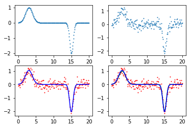
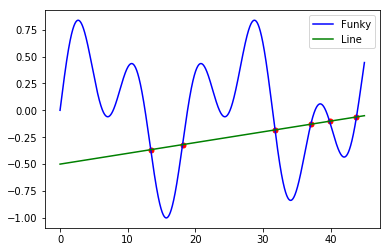
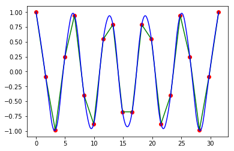
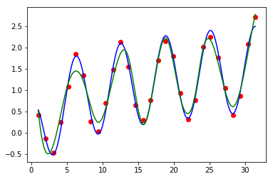

# Python科学计算 {#numpy_scipy}

## NumPy


### NumPy数组


```python
import numpy as np
import numpy.random as rand
import matplotlib.pyplot as plt
```


```python
## Numpy克服了Python中list速度慢的缺点，创建了新数据类型ndarray
## ndarray的每列元素一般是相同类型的，是浮点数、整型或字符串，这点和list不同
## 下面的例子测试对比了ndarray和list速度上的区别
## 首先建立一个0...10^7-1的10^7个元素的数组
arr=np.arange(1e7)
## 将ndarray转换为list
larr=arr.tolist()
## 工具函数，模拟ndarray把list的每个元素乘以一个标量的运算
def list_times(alist, scalar):
    for i, val in enumerate(alist):
        alist[i]=val*scalar
    return alist
## 比较ndarray和list每个元素乘以一个标量的运行时间
## 在我的电脑上，ndarray乘以一个标量的运行时间要比list快约33倍
%timeit arr*1.1
%timeit list_times(larr,1.1)
```

    37 ms ± 1.49 ms per loop (mean ± std. dev. of 7 runs, 10 loops each)
    1.22 s ± 41.4 ms per loop (mean ± std. dev. of 7 runs, 1 loop each)


```python
## 两个2维ndarray相乘是对应元素相乘，而两个matrix相乘是进行矩阵乘法
## matrix只有2维，以下代码运行会出错：shape too large to be a matrix
arr=np.zeros((3,3,3))
mat=np.matrix(arr)
```


    ---------------------------------------------------------------------------

    ValueError                                Traceback (most recent call last)

    <ipython-input-2-667d2452a8e0> in <module>()
          2 # matrix只有2维，以下代码运行会出错
          3 arr=np.zeros((3,3,3))
    ----> 4 mat=np.matrix(arr)
    

    ~/anaconda3/lib/python3.6/site-packages/numpy/matrixlib/defmatrix.py in __new__(subtype, data, dtype, copy)
        224             else:
        225                 intype = N.dtype(dtype)
    --> 226             new = data.view(subtype)
        227             if intype != data.dtype:
        228                 return new.astype(intype)


    ~/anaconda3/lib/python3.6/site-packages/numpy/matrixlib/defmatrix.py in __array_finalize__(self, obj)
        269                 return
        270             elif (ndim > 2):
    --> 271                 raise ValueError("shape too large to be a matrix.")
        272         else:
        273             newshape = self.shape


    ValueError: shape too large to be a matrix.


#### 创建数组和定义数据类型


```python
## 在NumPy中，创建数组有多种方法
## 首先创建一个list，然后用np.array()方法把它包裹起来
alist=[1,2,3]
arr=np.array(alist)
arr
```


    array([1, 2, 3])


```python
## 创建一个5个元素的全零数组
arr=np.zeros(5)
arr
```


    array([ 0.,  0.,  0.,  0.,  0.])


```python
## 创建一个从0到99的数组
arr=np.arange(100)
arr
```


    array([ 0,  1,  2,  3,  4,  5,  6,  7,  8,  9, 10, 11, 12, 13, 14, 15, 16,
           17, 18, 19, 20, 21, 22, 23, 24, 25, 26, 27, 28, 29, 30, 31, 32, 33,
           34, 35, 36, 37, 38, 39, 40, 41, 42, 43, 44, 45, 46, 47, 48, 49, 50,
           51, 52, 53, 54, 55, 56, 57, 58, 59, 60, 61, 62, 63, 64, 65, 66, 67,
           68, 69, 70, 71, 72, 73, 74, 75, 76, 77, 78, 79, 80, 81, 82, 83, 84,
           85, 86, 87, 88, 89, 90, 91, 92, 93, 94, 95, 96, 97, 98, 99])


```python
## 10到99的数组？
arr=np.arange(10,100)
arr
```


    array([10, 11, 12, 13, 14, 15, 16, 17, 18, 19, 20, 21, 22, 23, 24, 25, 26,
           27, 28, 29, 30, 31, 32, 33, 34, 35, 36, 37, 38, 39, 40, 41, 42, 43,
           44, 45, 46, 47, 48, 49, 50, 51, 52, 53, 54, 55, 56, 57, 58, 59, 60,
           61, 62, 63, 64, 65, 66, 67, 68, 69, 70, 71, 72, 73, 74, 75, 76, 77,
           78, 79, 80, 81, 82, 83, 84, 85, 86, 87, 88, 89, 90, 91, 92, 93, 94,
           95, 96, 97, 98, 99])


```python
## 0到1，中间有100步，linear space
arr=np.linspace(0,1,100)
arr
```


    array([ 0.        ,  0.01010101,  0.02020202,  0.03030303,  0.04040404,
            0.05050505,  0.06060606,  0.07070707,  0.08080808,  0.09090909,
            0.1010101 ,  0.11111111,  0.12121212,  0.13131313,  0.14141414,
            0.15151515,  0.16161616,  0.17171717,  0.18181818,  0.19191919,
            0.2020202 ,  0.21212121,  0.22222222,  0.23232323,  0.24242424,
            0.25252525,  0.26262626,  0.27272727,  0.28282828,  0.29292929,
            0.3030303 ,  0.31313131,  0.32323232,  0.33333333,  0.34343434,
            0.35353535,  0.36363636,  0.37373737,  0.38383838,  0.39393939,
            0.4040404 ,  0.41414141,  0.42424242,  0.43434343,  0.44444444,
            0.45454545,  0.46464646,  0.47474747,  0.48484848,  0.49494949,
            0.50505051,  0.51515152,  0.52525253,  0.53535354,  0.54545455,
            0.55555556,  0.56565657,  0.57575758,  0.58585859,  0.5959596 ,
            0.60606061,  0.61616162,  0.62626263,  0.63636364,  0.64646465,
            0.65656566,  0.66666667,  0.67676768,  0.68686869,  0.6969697 ,
            0.70707071,  0.71717172,  0.72727273,  0.73737374,  0.74747475,
            0.75757576,  0.76767677,  0.77777778,  0.78787879,  0.7979798 ,
            0.80808081,  0.81818182,  0.82828283,  0.83838384,  0.84848485,
            0.85858586,  0.86868687,  0.87878788,  0.88888889,  0.8989899 ,
            0.90909091,  0.91919192,  0.92929293,  0.93939394,  0.94949495,
            0.95959596,  0.96969697,  0.97979798,  0.98989899,  1.        ])


```python
## log10空间里1到10的数组，中间有100步
## numpy.logspace(start, stop, num=50, endpoint=True, base=10.0, dtype=None)
## base**start是数组的第一个元素，base**stop是数组的最后一个元素
arr=np.logspace(0,1,100,base=10.0)
arr
```


    array([  1.        ,   1.02353102,   1.04761575,   1.07226722,
             1.09749877,   1.12332403,   1.149757  ,   1.17681195,
             1.20450354,   1.23284674,   1.26185688,   1.29154967,
             1.32194115,   1.35304777,   1.38488637,   1.41747416,
             1.45082878,   1.48496826,   1.51991108,   1.55567614,
             1.59228279,   1.62975083,   1.66810054,   1.70735265,
             1.7475284 ,   1.78864953,   1.83073828,   1.87381742,
             1.91791026,   1.96304065,   2.009233  ,   2.05651231,
             2.10490414,   2.15443469,   2.20513074,   2.25701972,
             2.3101297 ,   2.36448941,   2.42012826,   2.47707636,
             2.53536449,   2.59502421,   2.65608778,   2.71858824,
             2.7825594 ,   2.84803587,   2.91505306,   2.98364724,
             3.05385551,   3.12571585,   3.19926714,   3.27454916,
             3.35160265,   3.43046929,   3.51119173,   3.59381366,
             3.67837977,   3.76493581,   3.85352859,   3.94420606,
             4.03701726,   4.1320124 ,   4.22924287,   4.32876128,
             4.43062146,   4.53487851,   4.64158883,   4.75081016,
             4.86260158,   4.97702356,   5.09413801,   5.21400829,
             5.33669923,   5.46227722,   5.59081018,   5.72236766,
             5.85702082,   5.9948425 ,   6.13590727,   6.28029144,
             6.42807312,   6.57933225,   6.73415066,   6.8926121 ,
             7.05480231,   7.22080902,   7.39072203,   7.56463328,
             7.74263683,   7.92482898,   8.11130831,   8.30217568,
             8.49753436,   8.69749003,   8.90215085,   9.11162756,
             9.32603347,   9.54548457,   9.77009957,  10.        ])


```python
## 创建一个5*5的全零数组
image=np.zeros((5,5))
image
```


    array([[ 0.,  0.,  0.,  0.,  0.],
           [ 0.,  0.,  0.,  0.,  0.],
           [ 0.,  0.,  0.,  0.,  0.],
           [ 0.,  0.,  0.,  0.,  0.],
           [ 0.,  0.,  0.,  0.,  0.]])


```python
## 创建一个5*5*5的全1的cube
## astype()方法将数组的元素全部设为整型
cube=np.zeros((5,5,5)).astype(int)+1
cube
```


    array([[[1, 1, 1, 1, 1],
            [1, 1, 1, 1, 1],
            [1, 1, 1, 1, 1],
            [1, 1, 1, 1, 1],
            [1, 1, 1, 1, 1]],
    
           [[1, 1, 1, 1, 1],
            [1, 1, 1, 1, 1],
            [1, 1, 1, 1, 1],
            [1, 1, 1, 1, 1],
            [1, 1, 1, 1, 1]],
    
           [[1, 1, 1, 1, 1],
            [1, 1, 1, 1, 1],
            [1, 1, 1, 1, 1],
            [1, 1, 1, 1, 1],
            [1, 1, 1, 1, 1]],
    
           [[1, 1, 1, 1, 1],
            [1, 1, 1, 1, 1],
            [1, 1, 1, 1, 1],
            [1, 1, 1, 1, 1],
            [1, 1, 1, 1, 1]],
    
           [[1, 1, 1, 1, 1],
            [1, 1, 1, 1, 1],
            [1, 1, 1, 1, 1],
            [1, 1, 1, 1, 1],
            [1, 1, 1, 1, 1]]])


```python
## 或者用更简单的方法创建全1数组，元素是16位浮点精度
cube=np.ones((5,5,5)).astype(np.float16)
cube
```


    array([[[ 1.,  1.,  1.,  1.,  1.],
            [ 1.,  1.,  1.,  1.,  1.],
            [ 1.,  1.,  1.,  1.,  1.],
            [ 1.,  1.,  1.,  1.,  1.],
            [ 1.,  1.,  1.,  1.,  1.]],
    
           [[ 1.,  1.,  1.,  1.,  1.],
            [ 1.,  1.,  1.,  1.,  1.],
            [ 1.,  1.,  1.,  1.,  1.],
            [ 1.,  1.,  1.,  1.,  1.],
            [ 1.,  1.,  1.,  1.,  1.]],
    
           [[ 1.,  1.,  1.,  1.,  1.],
            [ 1.,  1.,  1.,  1.,  1.],
            [ 1.,  1.,  1.,  1.,  1.],
            [ 1.,  1.,  1.,  1.,  1.],
            [ 1.,  1.,  1.,  1.,  1.]],
    
           [[ 1.,  1.,  1.,  1.,  1.],
            [ 1.,  1.,  1.,  1.,  1.],
            [ 1.,  1.,  1.,  1.,  1.],
            [ 1.,  1.,  1.,  1.,  1.],
            [ 1.,  1.,  1.,  1.,  1.]],
    
           [[ 1.,  1.,  1.,  1.,  1.],
            [ 1.,  1.,  1.,  1.,  1.],
            [ 1.,  1.,  1.,  1.,  1.],
            [ 1.,  1.,  1.,  1.,  1.],
            [ 1.,  1.,  1.,  1.,  1.]]], dtype=float16)


```python
## NumPy在生成数组时，默认使用系统的字长来创建数组元素
## 在64位的Python环境中，数组元素默认为64位精度的浮点数
## 这种设定消耗大量内存，很多时候并非必要
## 在创建数组时，用户可以自己设定元素的精度，即把dtype参数设为int, numpy.float16, 
## numpy.float32, numpy.float64

## 下面定义了一个全零的整型数组
arr1=np.zeros(2,dtype=int)
## 下面定义了一个全零的浮点型数组
arr2=np.zeros(2,dtype=np.float32)
print(arr1)
print(arr2)
```

    [0 0]
    [ 0.  0.]


```python
## 数组变形
## 创建一个125个元素的数组
arr1d=np.arange(125)
## 把数组变形为5*5*5的三维数组
arr3d=arr1d.reshape((5,5,5))
## 另一种效果相同的变形方法
arr3d=np.reshape(arr1d,(5,5,5))
print(arr3d)
## 把高维数组变形为一维数组
arr4d=np.zeros((10,10,10,10))
arr1d=arr4d.ravel()
print(arr1d.shape)
## 值得注意的是，数组的变形只是改变观察数组的角度，
## 并没有新创建数组，变形后的数组和变形前的数组使用的是相同的内存空间
## 因此改动其中一个数组的元素，另一个数组的元素也会跟着改变
## 要创建内存中完全不同的数组，需要使用numpy.copy函数
```

    [[[  0   1   2   3   4]
      [  5   6   7   8   9]
      [ 10  11  12  13  14]
      [ 15  16  17  18  19]
      [ 20  21  22  23  24]]
    
     [[ 25  26  27  28  29]
      [ 30  31  32  33  34]
      [ 35  36  37  38  39]
      [ 40  41  42  43  44]
      [ 45  46  47  48  49]]
    
     [[ 50  51  52  53  54]
      [ 55  56  57  58  59]
      [ 60  61  62  63  64]
      [ 65  66  67  68  69]
      [ 70  71  72  73  74]]
    
     [[ 75  76  77  78  79]
      [ 80  81  82  83  84]
      [ 85  86  87  88  89]
      [ 90  91  92  93  94]
      [ 95  96  97  98  99]]
    
     [[100 101 102 103 104]
      [105 106 107 108 109]
      [110 111 112 113 114]
      [115 116 117 118 119]
      [120 121 122 123 124]]]
    (10000,)


#### 记录数组（Record Arrays）


```python
## 数组一般来说是只包含一种数据类型，不过有些时候数组可以用来存储更复杂的数据结构，
## 每列由不同的数据类型组成，叫做记录数组
## 创建一个全零数组，定义列的类型（i4：32位整数，f4：32位浮点数，a10：长度为10的字符串）
recarr=np.zeros((2,),dtype=('i4,f4,a10'))
## 创建我们想放进recarr数组的列
col1=np.arange(2)+1 # array([1,2])
col2=np.arange(2,dtype=np.float32) # array([0.,1.], dtype=float32)
col3=["Hello","World"]
## 创建一个列表，整合上面3列
toadd=list(zip(col1,col2,col3))
## 给recarr赋值
recarr[:]=toadd
recarr
## 结果中字符串前的"b"：python3.x里默认的str是(py2.x里的)unicode, 
## bytes是(py2.x)的str, b”“前缀代表的就是bytes
```


    array([(1,  0., b'Hello'), (2,  1., b'World')],
          dtype=[('f0', '<i4'), ('f1', '<f4'), ('f2', 'S10')])


```python
## 给每一列赋一个名字，默认的名字是f0, f1, f2
recarr.dtype.names=("Integers","Floats","Strings")
## 用列的名字访问一列
recarr["Integers"]
```


    array([1, 2], dtype=int32)


#### 索引和切割


```python
## 要返回任意列，在Python的列表里不太容易，但在NumPy数组里很方便
## 定义一个列表
alist=[[1,2],[3,4]]
## 把列表转换为一个NumPy数组
arr=np.array(alist)
## 打印(0,1)元素
print(arr[0,1])
## 打印第二列
print(arr[:,1])
## 打印第二行
print(arr[1,:])
```

    2
    [2 4]
    [3 4]


```python
## 条件索引，常用numpy.where()，可以返回数组中需要的索引，基于条件，不考虑维度
## 创建一个数组
arr=np.arange(5)
## 创建索引数组
index=np.where(arr>2)
print(index)
## 根据索引创建需要的数组
new_arr1=arr[index]
print(new_arr)
## 使用np.delete()删除特定的索引
## 删除index中包含的元素
new_arr2=np.delete(arr,index)
print(new_arr2)
## 用简单的布尔列表作为下标返回需要的数组
## 使用布尔索引获得需要的元素比np.where()要迅速，并且可以通过~index轻易地反转布尔数组
index=arr>2
print(index)
new_arr=arr[index]
print(new_arr)
```

    (array([3, 4]),)
    [3 4]
    [0 1 2]
    [False False False  True  True]
    [3 4]


### 布尔语句和NumPy数组


```python
## 创建一个图片
img1=np.zeros((20,20))+3
img1[4:-4,4:-4]=6
img1[7:-7,7:-7]=9
## 见Plot A

## compound_index变量存储所有大于2或小于6的下标
index1=img1>2
index2=img1<6
compound_index=index1 & index2

## 复合索引的语句也可以写成这样：
compound_index=(img1>3) & (img1<7)
img2=np.copy(img1)
img2[compound_index]=0
## 见Plot B

## 使用更复杂的布尔数组
index3=img1==9
index4=(index1 & index2) | index3
img3=np.copy(img1)
img3[index4]=0
## 见Plot C
```


```python
## 仅变更数组中选中变量的值
## 依据标准正态分布（均值为0，方差为1）创建一个100个随机元素的数组
a=rand.randn(100)
print(a)
## 去掉不需要的元素
index=a>0.2
b=a[index]
## 在选出的元素上应用某些运算
b=b**2-2
## 把修改过的元素仍然放回原来的数组，这样就完成了对数组中某些值得变更
a[index]=b
print(a)
```

    [-1.80712517 -0.13170284  1.93343213  0.80721035  2.52144275  0.16195953
      0.11878839  1.88961184 -0.75881407 -1.22866865 -0.73857745  0.64046896
      0.73563193  0.71783485 -0.37645069  0.90120663 -0.59161068 -1.16366655
     -0.50663906 -0.36447979 -1.8654699   0.92406343  0.8004173  -1.41016169
      0.32592465  0.725013    0.29738016 -2.21113871 -0.68122701  0.66455187
     -0.32413105  1.13627295  0.13185364  1.38536725  0.19462378 -1.80775106
     -0.06199759 -1.30422952 -0.30685345  0.08940313 -0.67023186 -0.15051653
     -0.15879759  1.35984567 -0.2328225  -1.7265208   0.67232358 -0.59098342
     -1.20227104 -1.08216219 -0.53158487  1.33859499  0.66763318 -0.56431746
      0.75334062  1.44683156  1.9512399   0.42510796  0.34020597  0.72372802
     -0.10372294  0.184639    0.01761624 -0.69082466  0.36432908 -0.56651026
      0.21865567 -0.42096267 -0.73512854 -0.05493638 -1.94869892  0.76399321
      1.41936848  0.05750032 -0.12937963 -0.02329108 -1.47156894 -0.84254776
      0.75245785  0.07682322  0.96333808  0.92090036  0.76489123  0.63520238
     -0.08737849 -1.2083732   0.21328152  0.92891946  0.26792553  0.0672728
     -1.74821241  0.69335543 -0.60076278 -0.11200103 -1.4392716  -0.35400569
     -0.05871362  0.8178716   1.08160928  0.77033013]
    [-1.80712517 -0.13170284  1.73815979 -1.34841145  4.35767354  0.16195953
      0.11878839  1.57063289 -0.75881407 -1.22866865 -0.73857745 -1.58979952
     -1.45884566 -1.48471313 -0.37645069 -1.1878266  -0.59161068 -1.16366655
     -0.50663906 -0.36447979 -1.8654699  -1.14610677 -1.35933214 -1.41016169
     -1.89377312 -1.47435616 -1.91156504 -2.21113871 -0.68122701 -1.55837081
     -0.32413105 -0.70888379  0.13185364 -0.08075759  0.19462378 -1.80775106
     -0.06199759 -1.30422952 -0.30685345  0.08940313 -0.67023186 -0.15051653
     -0.15879759 -0.15081976 -0.2328225  -1.7265208  -1.547981   -0.59098342
     -1.20227104 -1.08216219 -0.53158487 -0.20816344 -1.55426593 -0.56431746
     -1.43247792  0.09332155  1.80733714 -1.81928322 -1.8842599  -1.47621775
     -0.10372294  0.184639    0.01761624 -0.69082466 -1.86726432 -0.56651026
     -1.9521897  -0.42096267 -0.73512854 -0.05493638 -1.94869892 -1.41631438
      0.01460689  0.05750032 -0.12937963 -0.02329108 -1.47156894 -0.84254776
     -1.43380718  0.07682322 -1.07197974 -1.15194253 -1.4149414  -1.59651793
     -0.08737849 -1.2083732  -1.95451099 -1.13710863 -1.92821591  0.0672728
     -1.74821241 -1.51925824 -0.60076278 -0.11200103 -1.4392716  -0.35400569
     -0.05871362 -1.33108605 -0.83012136 -1.40659148]


### NumPy读写文件


```python
## NumPy读文本文件中的矩阵
arr=np.loadtxt("data5/somefile.txt")
arr
```


    array([[  2.,   3.,   5.],
           [  7.,  11.,  13.],
           [ 17.,  19.,  23.]])


```python
## NumPy写矩阵到文本文件中
## numpy.savetxt(fname, X, fmt='%.18e', delimiter=' ', newline='\n', 
##	header='', footer='', comments='# ', encoding=None)[source]
np.savetxt("data5/somenewfile.txt",arr,"%d","\t")
```


```python
## loadtxt()读取文件中复杂的数据结构
recarr=np.loadtxt("data5/example.txt", dtype={
		"names":("Gene_ID","Sample1","Sample2","Sample3"),
		"formats":("S6","f4","f4","f4")})
recarr
```


    array([(b'Gene1',   2.29999995,   5.69999981,  11.13000011),
           (b'Gene2',  17.19000053,  23.29000092,  31.37000084)],
          dtype=[('Gene_ID', 'S6'), ('Sample1', '<f4'), 
		  ('Sample2', '<f4'), ('Sample3', '<f4')])


### NumPy的Math模块
	
#### 线性代数


```python
## 解矩阵方程AX=B
## 定义矩阵A, B
A=np.matrix([[3,6,-5],[1,-3,2],[5,-1,4]])
B=np.matrix([[12],[-2],[10]])
## 解矩阵方程，等号两边同时左乘A^(-1)
X=A**-1*B
print(X)
```

    [[ 1.75]
     [ 1.75]
     [ 0.75]]


```python
## 使用np.array，更快
a=np.array([[3,6,-5],[1,-3,2],[5,-1,4]])
b=np.array([[12],[-2],[10]])
x=np.linalg.inv(a).dot(b)
print(x)
```

    [[ 1.75]
     [ 1.75]
     [ 0.75]]


## SciPy

### 最优化和最小化

#### 数据建模和拟合


```python
from scipy.optimize import curve_fit
```


```python
## 拟合线性分布
## 创建一个函数，用来建模和创建数据
def func(x,a,b):
    return a*x+b

## 生成干净的数据
x=np.linspace(0,10,100)
y=func(x,1,2)

## 加入噪声
yn=y+0.9*np.random.normal(size=len(x))

## 在有噪声的数据上应用curve_fit
## popt返回给定模型（func）下的参数的最佳拟合值
## pcov返回一个矩阵表示拟合的质量，矩阵对角线上的值是各参数的方差
popt,pcov=curve_fit(func,x,yn)

print(popt)
```

    [ 1.06107439  1.7517619 ]


```python
fig=plt.figure()

ax1=fig.add_subplot(2,2,1)
ax2=fig.add_subplot(2,2,2)
ax3=fig.add_subplot(2,2,3)
ax4=fig.add_subplot(2,2,4)

ax1.scatter(x,y,1)

ax2.scatter(x,yn,1)

ax3.scatter(x,yn,1,"red")
ax3.plot(x,popt[0]*x+popt[1],"blue")

ax4.scatter(x,yn,1,"red")
ax4.plot(x,y,"green")
ax4.plot(x,popt[0]*x+popt[1],"blue")

plt.show()
```


```{r}
knitr::include_graphics("08_Python_pythonic_numpy_scipy_files/08_Python_pythonic_numpy_scipy_35_0.png")
```


```python
## 拟合高斯分布
## 创建一个函数，用来建模和创建数据
def func(x,a,b,c):
    return a*np.exp(-(x-b)**2/(2*c**2))

## 生成干净的数据
x=np.linspace(0,10,100)
y=func(x,1,5,2)

## 加入噪声
yn=y+0.2*np.random.normal(size=len(x))

## 在有噪声的数据上应用curve_fit
## popt返回给定模型（func）下的参数的最佳拟合值
## pcov返回一个矩阵表示拟合的质量，矩阵对角线上的值是各参数的方差
popt, pcov = curve_fit(func, x, yn)

print(popt)
```

    [ 1.03822218  5.01637962 -1.88413558]


```python
fig=plt.figure()

ax1=fig.add_subplot(2,2,1)
ax2=fig.add_subplot(2,2,2)
ax3=fig.add_subplot(2,2,3)
ax4=fig.add_subplot(2,2,4)

ax1.scatter(x,y,1)

ax2.scatter(x,yn,1)

ax3.scatter(x,yn,1,"red")
ax3.plot(x,popt[0]*np.exp(-(x-popt[1])**2/(2*popt[2]**2)),"blue")

ax4.scatter(x,yn,1,"red")
ax4.plot(x,y,"green")
ax4.plot(x,popt[0]*np.exp(-(x-popt[1])**2/(2*popt[2]**2)),"blue")

plt.show()
```


```{r}
knitr::include_graphics("08_Python_pythonic_numpy_scipy_files/08_Python_pythonic_numpy_scipy_37_0.png")
```


```python
## 拟合两个高斯分布的线性组合
## 创建一个函数，用来建模和创建数据
def func(x,a0,b0,c0,a1,b1,c1):
    return a0*np.exp(-(x-b0)**2/(2*c0**2))+a1*np.exp(-(x-b1)**2/(2*c1**2))

## 生成干净的数据
x=np.linspace(0,20,200)
y=func(x,1,3,1,-2,15,0.5)

## 加入噪声
yn=y+0.2*np.random.normal(size=len(x))

## 在有噪声的数据上应用curve_fit
## popt返回给定模型（func）下的参数的最佳拟合值
## pcov返回一个矩阵表示拟合的质量，矩阵对角线上的值是各参数的方差
popt, pcov = curve_fit(func, x, yn)

print(popt)
```

    [ -2.04644312  14.99180963   0.50668406   1.05196114   2.97782597
       0.99894884]


```python
fig=plt.figure()

ax1=fig.add_subplot(2,2,1)
ax2=fig.add_subplot(2,2,2)
ax3=fig.add_subplot(2,2,3)
ax4=fig.add_subplot(2,2,4)

ax1.scatter(x,y,1)

ax2.scatter(x,yn,1)

ax3.scatter(x,yn,1,"red")
ax3.plot(x,popt[0]*np.exp(-(x-popt[1])**2/(2*popt[2]**2))+
		popt[3]*np.exp(-(x-popt[4])**2/(2*popt[5]**2)),"blue")

ax4.scatter(x,yn,1,"red")
ax4.plot(x,y,"green")
ax4.plot(x,popt[0]*np.exp(-(x-popt[1])**2/(2*popt[2]**2))+
		popt[3]*np.exp(-(x-popt[4])**2/(2*popt[5]**2)),"blue")
ax4.legend(loc=0, bbox_to_anchor=(1,1))

plt.show()
```


```{r}

```


#### 函数的解


```python
from scipy.optimize import fsolve
```


```python
line=lambda x:x+3
solution=fsolve(line,-2)
print(solution)
```

    [-3.]


```python
fig = plt.figure()
ax=fig.add_subplot(1,1,1)
x=np.linspace(-10,10,100)
zeros=np.zeros(100)
ax.plot(x,line(x),"blue",label="Function")
ax.plot(x,zeros,"g--",label="y=0")
ax.scatter(solution,line(solution),25,"red",label="Root")
ax.legend(loc="best", bbox_to_anchor=(1,1))
plt.show()
```


```{r}
knitr::include_graphics("08_Python_pythonic_numpy_scipy_files/08_Python_pythonic_numpy_scipy_43_0.png")
```


```python
## 找到两个函数的交点
## 定义一个函数来简化求交点的过程
def findIntersection(func1,func2,x0):
    return fsolve(lambda x:func1(x)-func2(x),x0)

## 定义两个函数，准备求它们的交点
funky=lambda x:np.cos(x/5)*np.sin(x/2)
line=lambda x:0.01*x-0.5

## 设置函数的定义域，求两个函数的交点
x=np.linspace(0,45,10000)
result=findIntersection(funky,line,[15,20,30,35,40,45])

## 打印交点的坐标
print(result,line(result))
```

    [ 13.40773078  18.11366128  31.78330863  37.0799992   39.84837786
      43.8258775 ] [-0.36592269 -0.31886339 -0.18216691 -0.12920001 -0.10151622 -0.06174122]


```python
fig = plt.figure()
ax=fig.add_subplot(1,1,1)
x=np.linspace(0,45,10000)
ax.plot(x,funky(x),"blue",label="Funky")
ax.plot(x,line(x),"green",label="Line")
ax.scatter(result,line(result),25,"red")
ax.legend(loc="best", bbox_to_anchor=(1,1))
plt.show()
```


```{r}

```


### 插值

* 插值法在离散数据的基础上补插连续函数，使得这条连续曲线通过全部给定的离散数据点。
* 插值是离散函数逼近的重要方法，利用它可通过函数在有限个点处的取值状况，估算出函数在其他点处的近似值。
* 常用来填充图像变换时像素之间的空隙。
* 计算插值有两种基本方法：
    * 用一个函数对整个数据集进行拟合
    * 对数据集不同的部分用几个不同函数拟合，各函数的连接点都是光滑的
* 第二种方法称为样条插值，当数据的函数形式复杂的时候，样条插值是非常强大的工具


```python
from scipy.interpolate import interp1d
```


```python
## 创建离散数据集
x=np.linspace(0,10*np.pi,20)
y=np.cos(x)

## 分别用线性函数和二次函数，对数据进行插值
fl=interp1d(x,y,kind="linear")
fq=interp1d(x,y,kind="quadratic")

## 得到两个连续函数上的点
xint=np.linspace(x.min(),x.max(),1000)
yintl=fl(xint)
yintq=fq(xint)
```


```python
fig = plt.figure()
ax=fig.add_subplot(1,1,1)
ax.plot(x,y,"ro",xint,yintl,"g-",xint,yintq,"b-")
plt.show()
```


```{r}

```


```python
from scipy.interpolate import UnivariateSpline
```


```python
## 对有噪声的函数进行插值
## 创建数据集，加入人工噪声
sample=30
x=np.linspace(1,10*np.pi,sample)
y=np.cos(x)+np.log10(x)+np.random.randn(sample)/10

## 对数据进行插值，参数s是光滑因子，若s=0，插值会经过所有点不考虑噪声，若s=1，则考虑噪声
f=UnivariateSpline(x,y,s=1)

## 得到插值函数上的点
xint=np.linspace(x.min(),x.max(),1000)
yint=f(xint)
```


```python
fig = plt.figure()
ax=fig.add_subplot(1,1,1)
x1000=np.linspace(1,10*np.pi,1000)
y1000=np.cos(x1000)+np.log10(x1000)
ax.plot(x,y,"ro",x1000,y1000,"b-",xint,yint,"g-")
plt.show()
```


```{r}

```


```python
from scipy.interpolate import griddata
```


```python
# 创建一个1000*1000像素的图片，在图片上随机选1000个点，看插值函数如何能根据这1000个点重构图片
## 创建一个函数
ripple=lambda x,y:np.sqrt(x**2+y**2)+np.sin(x**2+y**2)
## 生成网格数据，复数1000j表示在0到5之间生成1000个点，包含0和5
grid_x, grid_y = np.mgrid[0:5:1000j, 0:5:1000j]
## 随机生成插值函数可见的1000个点的抽样
xy = np.random.rand(1000, 2)
sample = ripple(xy[:,0] * 5 , xy[:,1] * 5)
## 用三次函数方法生成抽样数据的插值
grid_z0 = griddata(xy * 5, sample, (grid_x, grid_y), method='cubic')
## 用线性方法生成抽样数据的插值
grid_z1 = griddata(xy * 5, sample, (grid_x, grid_y), method='linear')
## 用Nearest方法生成抽样数据的插值
grid_z2 = griddata(xy * 5, sample, (grid_x, grid_y), method='nearest')
```


```python
plt.subplot(221)
plt.title('Original')
plt.imshow(ripple(grid_x, grid_y).T,extent=(0,5,0,5))
plt.plot(xy[:,0]*5, xy[:,1]*5, 'b.',ms=3)
plt.subplot(222)
plt.title('Cubic')
plt.imshow(grid_z0.T,extent=(0,5,0,5))
plt.subplot(223)
plt.title('Linear')
plt.imshow(grid_z1.T,extent=(0,5,0,5))
plt.subplot(224)
plt.title('Nearest')
plt.imshow(grid_z2.T,extent=(0,5,0,5))
plt.show()
```


```{r}
knitr::include_graphics("08_Python_pythonic_numpy_scipy_files/08_Python_pythonic_numpy_scipy_55_0.png")
```

